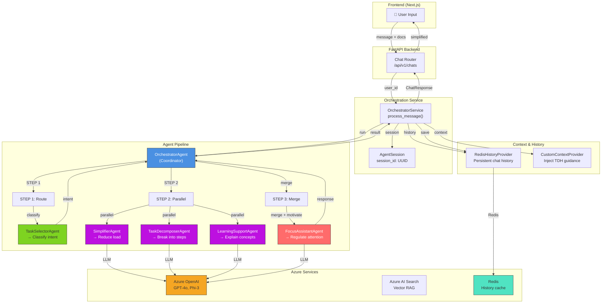
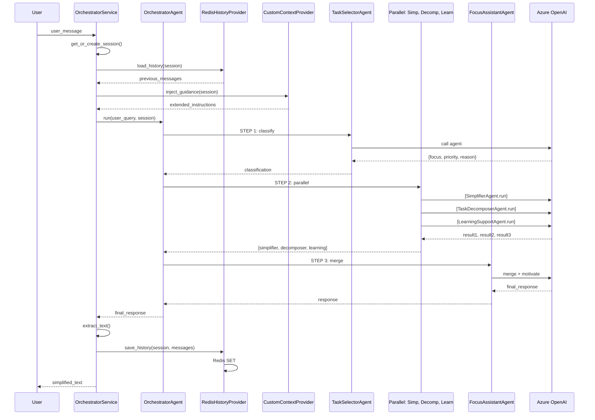
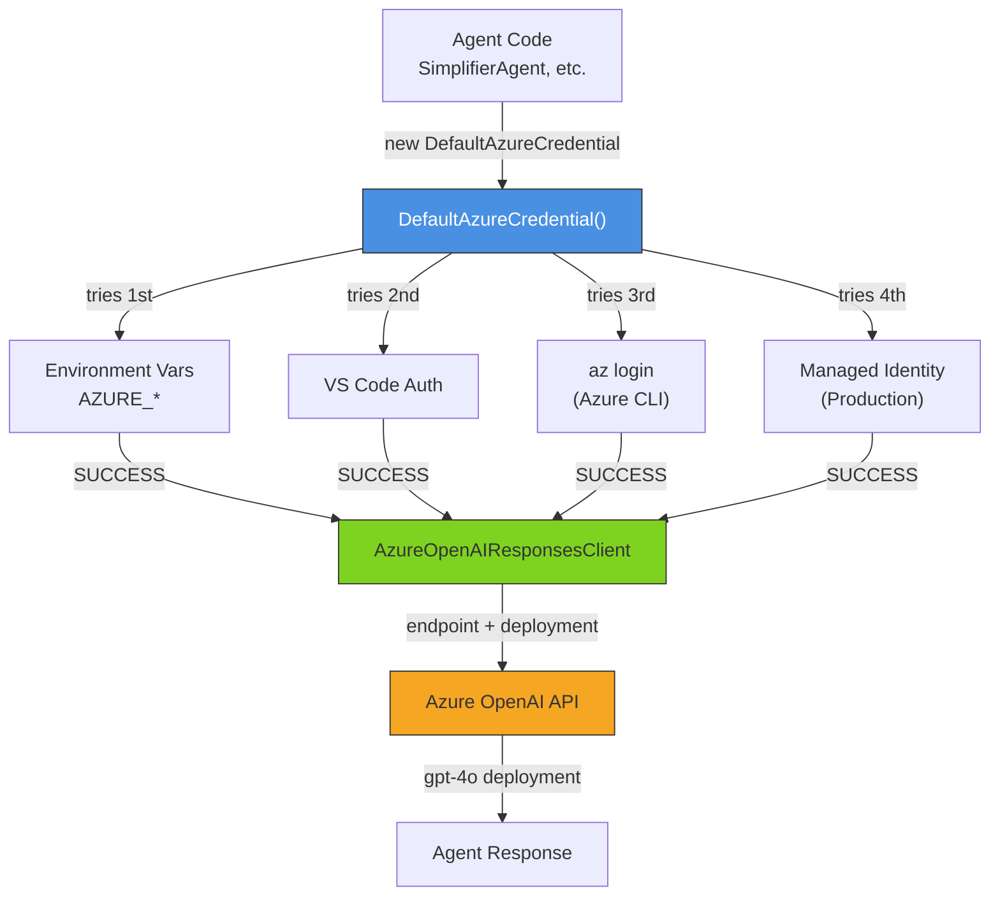
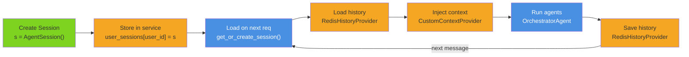

# Brilliant Minds Agents System — Comprehensive Technical Documentation

**Documentation Version:** 2.0 (Updated after exhaustive review)  
**Last Updated:** March 2026  
**Framework:** Azure AI Agent Framework + OpenAI/Azure OpenAI  
**Status:** Production-Ready with RAG Integration Points

---

## Table of Contents

1. [System Overview](#system-overview)
2. [Agent Architecture](#agent-architecture)
3. [Individual Agents](#individual-agents)
4. [Orchestration Flow](#orchestration-flow)
5. [Context & History Management](#context--history-management)
6. [Tools & RAG Integration](#tools--rag-integration)
7. [Azure Integration Details](#azure-integration-details)
8. [Session Management](#session-management)
9. [Development & Testing](#development--testing)

---"

## System Overview

### Mission

Brilliant Minds uses a **multi-agent system** to provide cognitive-load reduction for users with ADHD, dyslexia, and autism spectrum disorder (ASD). Each agent specializes in one aspect of the simplification pipeline:

- **Task Selector:** Route incoming requests to the appropriate focus
- **Simplifier:** Reduce linguistic complexity while preserving meaning
- **Task Decomposer:** Break tasks into digestible steps
- **Learning Support:** Explain concepts adaptively
- **Focus Assistant:** Regulate attention and provide encouragement

### System Architecture



---

## Agent Architecture

### Base Agent Pattern

**File:** `src/agents/providers/base_agent.py`

All agents inherit from a common base class that provides **lazy initialization** and **lazy-loading** of Azure credentials.

```python
from abc import ABC, abstractmethod

class BaseAgent(ABC):
    """Abstract base for all agents"""
    
    _agent_instance = None  # Lazy singleton
    _client_instance = None
    
    async def get_agent(self):
        """Lazy-load agent on first call"""
        if self._agent_instance is None:
            self._client_instance = await self._create_client()
            self._agent_instance = await self._create_agent()
        return self._agent_instance
    
    async def run(self, message: str, session) -> AgentResponse:
        """Execute agent with message"""
        agent = await self.get_agent()
        return await agent.invoke(message, session=session)
    
    @abstractmethod
    async def _create_client(self):
        """Subclasses implement their client (Azure OpenAI, OpenAI, etc.)"""
        pass
    
    @abstractmethod
    async def _create_agent(self):
        """Subclasses implement their agent initialization"""
        pass
```

**Why Lazy Loading?**

- Credentials not loaded until first agent call
- If an agent is never used, its client isn't created
- Cost reduction in large deployments

### Provider Types

| Provider | Backend | Use Case | Location |
|----------|---------|----------|----------|
| **AzureResponsesAgent** | `AzureOpenAIResponsesClient` (Azure AI Agent Framework) | Primary — responses-based agents | `src/agents/providers/azure_responses_provider.py` |
| **AIProjectProvider** | `AIProjectClient` (Azure AI Projects SDK) | Versioned agents with audit trail | `src/agents/providers/azure_ai_project.py` |
| **OpenAIProvider** | `OpenAIChatClient` (direct OpenAI) | Fallback or testing | `src/agents/providers/openai_provider.py` |

### Response Normalization

All agents return responses in a standardized format:

```python
@dataclass
class AgentResponse:
    text: str                    # Main response
    metadata: Optional[dict]     # Optional: tool calls, reasoning, etc.
    
    @classmethod
    def from_framework_response(cls, response):
        """Convert framework-specific response to AgentResponse"""
        if hasattr(response, "text"):
            return cls(text=response.text)
        elif hasattr(response, "messages"):
            return cls(text=response.messages[-1].text)
        else:
            return cls(text=str(response))
```

---

## Individual Agents

### Task Selector Agent

**File:** `src/agents/task_selector_agent.py`  
**Provider:** AzureResponsesAgent  
**Purpose:** Route incoming user request to appropriate workflow

#### Responsibilities

1. Classify user intent
2. Determine cognitive priority
3. Route to correct sub-agent pipeline

#### System Prompt Themes

```
"You are a cognitive classifier for ADHD learners.
 Analyze the user's query and determine:
 1. Focus: Which aspect needs help?
    - simplificar (complex language)
    - descomponer (large tasks)
    - estrategias (learning strategies)
    - combinado (mix of above)
 2. Priority: Which is most urgent?
 3. Reason: Explain your classification
 
 Output as JSON: {focus, priority, reason}"
```

#### Output Example

```json
{
  "focus": "descomponer",
  "priority": "high",
  "reason": "User asking to 'create presentation' - complex task needing steps"
}
```

#### Used By

- OrchestratorAgent (STEP 1)

---

### Simplifier Agent

**File:** `src/agents/simplifier_agent.py`  
**Provider:** AzureResponsesAgent  
**Purpose:** Reduce cognitive load by simplifying language

#### Responsibilities

1. Break complex sentences into shorter ones
2. Replace technical terms with accessible vocabulary
3. Maintain essential meaning
4. Adapt to reading level (A1-C1)
5. Support ADHD/ASD/Dyslexia preferences

#### System Prompt Excerpt

```
"You are a language simplifier for accessible learning.
 Your goal: Keep ALL meaning, reduce COMPLEXITY.
 
 Rules:
 - NO new concepts or unrelated info
 - Break sentences: max {max_sentence_length} words each
 - Replace technical terms with everyday words
 - Use simple connecting words (and, but, because)
 - For ADHD: Use bullets, highlights, short paragraphs
 - For Dyslexia: Simple vocabulary, avoid dense blocks
 - For ASD: Literal language, consistent structure, explicit labeling
 
 Input: [complex text]
 Output: [simplified version]"
```

#### Input

```python
{
    "text": "Photosynthesis is the biochemical process by which chlorophyll-containing organisms convert light energy into chemical energy.",
    "reading_level": "B1",
    "max_sentence_length": 12,
    "condition": "adhd"
}
```

#### Output

```
Plants use sunlight to make food.

How it works:
1. Leaves catch sunlight
2. Water enters roots
3. Air enters leaves (CO₂)
4. Plant turns these into sugar for energy
```

#### Cognitive Profiles

| Profile | Strategy | Example Adaptation |
|---------|----------|-------------------|
| **ADHD** | Structure + chunking | Bullet points, visual breaks, key highlights |
| **Dyslexia** | Simple vocab + spacing | Large font, short lines, high contrast, minimal jargon |
| **ASD** | Literal + consistent | Explicit connections, structured format, precise definitions |

#### Used By

- OrchestratorAgent (STEP 2, parallel)
- FocusAssistantAgent (merge & review)

---

### Task Decomposer Agent

**File:** `src/agents/task_decomposer_agent.py`  
**Provider:** AzureResponsesAgent  
**Purpose:** Break complex tasks into simple steps

#### Responsibilities

1. Analyze task complexity
2. Break into sequential, actionable steps
3. Explain dependencies
4. Provide optional checklist
5. Adapt step count to fatigue level

#### System Prompt Excerpt

```
"You are a task breakdown specialist for learners with ADHD.
 
 Goal: Turn complex tasks into clear, doable steps.
 
 Each step:
 - ONE action (not multiple)
 - Clear starting point
 - Clear completion criteria
 - Estimated time
 
 Format:
 Step 1: [action]
 How: [explanation]
 Time: [estimate]
 ✓ Done when: [criteria]
 
 Variations:
 - ADHD: Fewer steps (max 5), shorter, action-oriented
 - ASD: Highly structured, explicit dependencies, clear labeling
 - Dyslexia: Simple words, visual structure, avoid dense text"
```

#### Input

```python
{
    "task": "Create a presentation on photosynthesis",
    "fatigue_level": 1,  # 0=fresh, 2=exhausted
    "support_level": "adhd"
}
```

#### Output

```
Step 1: Gather information
How: Find 2-3 simple sources on plants + light
Time: 10 minutes
✓ Done when: You have 3 key facts written down

Step 2: Create outline
How: 3 sections - What, How, Why
Time: 5 minutes
✓ Done when: You have topic sentences for each section

Step 3: Add visuals
How: Find or draw 1-2 diagrams
Time: 10 minutes
✓ Done when: Resources are in your presentation file

Step 4: Write speaker notes
How: 1-2 sentences per slide
Time: 10 minutes
✓ Done when: Each slide has notes

Step 5: Practice + review
How: Read aloud once, check timing
Time: 5 minutes
✓ Done when: You feel ready
```

#### Used By

- OrchestratorAgent (STEP 2, parallel)
- FocusAssistantAgent (merge & review)

---

### Learning Support Agent

**File:** `src/agents/learning_support_agent.py`  
**Provider:** AzureResponsesAgent  
**Purpose:** Adaptive explanations for concept comprehension

#### Responsibilities

1. Explain complex concepts simply
2. Build understanding progressively
3. Provide examples and analogies
4. Use Socratic method (guiding questions)
5. Adapt to prior knowledge

#### System Prompt Excerpt

```
"You are an adaptive educational assistant for neurodiverse learners.

Goal: Explain clearly and progressively. NOT to overwhelm.

Approach:
1. Start with familiar analogy
2. Introduce ONE new concept
3. Use concrete examples
4. Offer guiding questions (not answers)
5. Summarize in simple terms

Cognitive adaptations:
- ADHD: Short blocks, key highlights, action orientation
- ASD: Precise definitions, consistent structure, explicit rules
- Dyslexia: Simple vocabulary, short lines, visual clarity

Modes:
- Pedagogical: Include exercises, guided questions
- Direct: Concise explanation only"
```

#### Input

```python
{
    "concept": "photosynthesis",
    "prior_knowledge": "plants need water and sun",
    "reading_level": "B1",
    "mode": "pedagogical"
}
```

#### Output

```
Think of a plant like a tiny factory:

Raw materials:
- Sunlight (power)
- Water (from roots)
- Air/CO₂ (ingredient)

The factory makes sugar (plant food):
Sugar gives the plant energy to grow.

How it's like cooking:
- Sun = heat source
- Water + CO₂ = ingredients
- Leaves = cooking pot
- Sugar = finished dish

Try this:
Q: Where does the water come from?
Q: Why do plants need sunlight?
(These help you remember the steps)

In one sentence:
"Plants turn sunlight, water, and air into food."
```

#### Used By

- OrchestratorAgent (STEP 2, parallel)
- FocusAssistantAgent (merge & review)

---

### Focus Assistant Agent

**File:** `src/agents/focus_assistant_agent.py`  
**Provider:** AzureResponsesAgent  
**Purpose:** Regulate attention and prevent cognitive overload

#### Responsibilities

1. Monitor cognitive load signals
2. Provide timely interventions
3. Merge results from parallel agents
4. Add motivational framing
5. Adjust intensity based on response

#### Cognitive Load Signals

| Signal | Example | Intervention |
|--------|---------|-------------|
| **Too much text** | Response > 500 words | "Let's break this into smaller chunks" |
| **No progress** | Stuck on one step | "Let's try a different approach" |
| **Task abandonment** | Many context switches | "Focus on ONE thing right now" |
| **Fatigue** | Repeated errors | "Take a 5-minute break" |

#### System Prompt Excerpt

```
"You are an attention regulator for ADHD learners.

Your role: Prevent overwhelm, encourage progress.

Monitor for:
- Task length (too long = break into pieces)
- Complexity (too hard = offer scaffolding)
- Motivation (low = celebrate small wins)
- Fatigue (high = suggest break)

Interventions (soft):
- "You're doing great! Let's pause here."
- "That's one step done! Next is..."
- "Take 5 minutes, then come back."
- "You got this! Here's the easier way..."

Merge outputs from:
- SimplifierAgent (clarity)
- TaskDecomposerAgent (steps)
- LearningSupportAgent (explanation)

Your final output should:
- Consolidate all 3 perspectives
- Add motivation
- Suggest next small action"
```

#### Input

```python
{
    "simplified_text": "...",  # From SimplifierAgent
    "decomposed_steps": [...],  # From TaskDecomposerAgent
    "explanation": "...",       # From LearningSupportAgent
    "fatigue_level": 1,
    "tone_preference": "calm_supportive"
}
```

#### Output

```
✨ Great start! Here's what we've got:

📖 WHAT TO READ:
[Simplified explanation]

✅ STEPS TO TAKE:
1. [Step 1]
2. [Step 2]
...

💡 WHY THIS MATTERS:
[Learning explanation]

🎯 NEXT MOVE:
Start with Step 1 — takes about 5 minutes.
You've got this! 💪

Want a break first? That's totally okay.
```

#### Used By

- OrchestratorAgent (STEP 3)

---

### Explainability Agent

**File:** `src/agents/explainability_agent.py`  
**Provider:** AIProjectProvider (versioned)  
**Purpose:** Translate system decisions for educators/admins

#### Status

⚠️ **Partial implementation** — Not currently wired into the API, but infrastructure complete.

#### Intended Use

Provide transparency reports to teachers about:

- Why an agent chose a particular approach
- How user profile influenced output
- Adaptation details (cognitive + accessibility)
- Safety validation results

#### Example Report

```
EXPLANATION REPORT for User: student-123

Original Input:
"Explain photosynthesis"

Agent Processing:
1. TaskSelector classified as: "explain" (priority: medium)
2. SimplifierAgent adapted for: Reading Level B1, ADHD profile
3. LearningSupportAgent used: Analogies + scaffolding
4. FocusAssistant added: Motivational framing + break suggestion

Adaptations Applied:
- Reduced jargon from 15 technical terms to 3 key terms
- Broke complex explanation into 5 digestible sections
- Added concrete analogy (plant factory = cooking)
- Included reflection questions

Safety Checks:
✓ WCAG 2.2 compliance
✓ Content Safety: OK
✓ Pedagogical appropriateness: OK

Recommendation:
Student engaged with explanation; consider expanding to photosynthesis variation next.
```

---

### Triage Agent

**File:** `src/agents/triage_agent.py`  
**Provider:** AIProjectProvider (versioned)  
**Purpose:** Intent classification and routing

#### Status

⚠️ **Partial implementation** — Available but not currently used in main orchestration.

#### Intended Use

Early-stage request analysis to:

- Detect user intent (question, task, help-seeking)
- Flag safety concerns
- Route to specialized sub-systems

---

## Orchestration Flow

### The OrchestratorAgent

**File:** `src/agents/orchestrator_agent.py`

The **coordinator** that runs the full pipeline:

```python
class OrchestratorAgent:
    """Runs the complete ADHD-optimized workflow"""
    
    async def run(self, user_query: str, session: AgentSession):
        """Execute the 3-step pipeline"""
        
        # STEP 1: Classify intent
        task_selector = TaskSelectorAgent()
        classification = await task_selector.run(user_query, session)
        
        # STEP 2: Run agents in parallel
        async with asyncio.TaskGroup() as tg:
            simplifier_task = tg.create_task(
                SimplifierAgent().run(user_query, session)
            )
            decomposer_task = tg.create_task(
                TaskDecomposerAgent().run(user_query, session)
            )
            learning_task = tg.create_task(
                LearningSupportAgent().run(user_query, session)
            )
        
        # Gather parallel results
        simplifier_result = simplifier_task.result()
        decomposer_result = decomposer_task.result()
        learning_result = learning_task.result()
        
        # STEP 3: Merge and add motivation
        focus_assistant = FocusAssistantAgent()
        final_response = await focus_assistant.run(
            {
                "simplified": simplifier_result.text,
                "decomposed": decomposer_result.text,
                "explanation": learning_result.text,
                "classification": classification
            },
            session
        )
        
        return final_response
```

### Pipeline Diagram



---

## Context & History Management

### Custom Context Provider

**File:** `src/agents/context/custom_context.py`

Injects TDH-specific guidance into each agent call:

```python
class CustomContextProvider(BaseContextProvider):
    """Inject Brilliant Minds-specific instructions before agent runs"""
    
    async def before_run(self, *, agent, session, context, state):
        """Extend instructions with TDH guidance"""
        
        # Extract user name from session state (if available)
        user_name = session.state.get("user_name")
        if user_name:
            context.extend_instructions(
                f"Use warm, empathetic tone. Use the name '{user_name}' occasionally."
            )
        
        # Add ADHD-specific guidance
        context.extend_instructions("""
            ADHD User Adaptations:
            - Use short sentences (max 12 words)
            - Bullet points for complex ideas
            - Highlight key takeaways with emojis or bold
            - Avoid walls of dense text
            - Provide clear next steps
        """)
        
        # Add accessibility info
        if session.state.get("reading_level"):
            context.extend_instructions(
                f"Adapt vocabulary and sentence structure for {session.state['reading_level']} level."
            )
    
    async def after_run(self, *, agent, session, context, state):
        """Capture data after agent runs"""
        # Extract user name from patterns like "mi nombre es [name]"
        # Store in session.state for future use
```

### Redis History Provider

**File:** `src/agents/context/history_provider.py`

Persistent chat history for conversation continuity:

```python
class RedisHistoryProvider(BaseHistoryProvider):
    """Store and retrieve chat history from Redis"""
    
    async def provide_chat_history(self, session: AgentSession):
        """Load conversation history"""
        key = f"tdh:history:{session.session_id}"
        history_json = await redis_client.get(key)
        
        if not history_json:
            return []  # First message
        
        return json.loads(history_json)
    
    async def store_chat_history(self, session: AgentSession, messages: list):
        """Persist conversation"""
        key = f"tdh:history:{session.session_id}"
        await redis_client.set(
            key,
            json.dumps(messages),
            ex=86400 * 7  # 7-day expiry
        )
```

### AgentSession

```python
@dataclass
class AgentSession:
    session_id: str = Field(default_factory=lambda: uuid.uuid4().hex)
    user_id: str = ""
    state: Dict[str, Any] = Field(default_factory=dict)
    history: List[Dict] = Field(default_factory=list)
```

**Session State Example:**

```python
{
    "user_name": "Carlos",
    "reading_level": "B1",
    "condition": "adhd",
    "fatigue_level": 1,
    "last_agent": "FocusAssistantAgent",
    "message_count": 5
}
```

---

## Tools & RAG Integration

### MCP Tool

**File:** `src/agents/tools/mcp_tool.py`

Knowledge base retrieval tool for agents:

```python
def build_mcp_tool():
    """Build tool for knowledge base queries"""
    endpoint = MCPConnectionSettings.get_mcp_endpoint()
    connection_id = MCPConnectionSettings.get_project_connection_id()
    
    return MCPTool(
        server_label="knowledge-base",
        server_url=endpoint,
        allowed_tools=["knowledge_base_retrieve"],
        require_approval="never"
    )
```

**Purpose:** Allow agents to ground responses in indexed documents.

**Currently:** Tool infrastructure is complete but **not actively passed to agents** in the orchestration pipeline.

### RAG Modes

| Mode | Status | Technology | Use Case |
|------|--------|-----------|----------|
| **Classic (v1)** | ✅ Available | Dense embeddings (1536-dim) | General semantic search |
| **Layout RAG (v2)** | ⏳ Experimental | Form Recognizer + Layout | Preserve document structure |
| **Multimodal RAG (v3)** | ⏳ Experimental | Vision + text embeddings | Images + text indexing |
| **Agentic RAG** | ⏳ Experimental | MCP + Knowledge Assets | Agent-driven retrieval |

---

## Azure Integration Details

### Authentication Flow



### Configuration

**File:** `src/config/settings.py`

```python
class AgentSettings(BaseSettings):
    """Agent Framework configuration"""
    AZURE_AI_PROJECT_ENDPOINT: str      # Required
    AZURE_OPENAI_RESPONSES_DEPLOYMENT_NAME: str  # Required

class AzureOpenAISettings(BaseSettings):
    """Azure OpenAI configuration"""
    AOAI_ENDPOINT: str                  # Required
    AOAI_KEY: str                       # Required
    AOAI_DEPLOYMENT_NAME: str           # LLM model (e.g., "gpt-4o")
    AI_MODEL_NAME: str = "gpt-4o"       # Model ID
    EMBEDDING_DEPLOYMENT_NAME: str = "text-embedding-3-small"
```

### Required Environment Variables

```bash
# Agent Framework
AZURE_AI_PROJECT_ENDPOINT=https://resource-name.api.azureml-test.net
AZURE_OPENAI_RESPONSES_DEPLOYMENT_NAME=gpt-4o-responses

# Azure OpenAI (LLM calling)
AOAI_ENDPOINT=https://resource-name.openai.azure.com/
AOAI_KEY=your-key
AOAI_DEPLOYMENT_NAME=gpt-4o
AI_MODEL_NAME=gpt-4o
EMBEDDING_DEPLOYMENT_NAME=text-embedding-3-small

# Redis (History)
REDIS_URL=redis://localhost:6379
```

### Client Initialization

```python
from azure.identity import DefaultAzureCredential
from microsoft.agent_framework import AzureOpenAIResponsesClient

credential = DefaultAzureCredential()

client = AzureOpenAIResponsesClient(
    project_endpoint=settings.agent_settings.AZURE_AI_PROJECT_ENDPOINT,
    deployment_name=settings.agent_settings.AZURE_OPENAI_RESPONSES_DEPLOYMENT_NAME,
    credential=credential
)

# Use the client
config = {"type": "function_calling"}
agent = client.as_agent("my-agent", instructions="...", tools=[], config=config)
result = await agent.invoke(user_message, session=session)
```

---

## Session Management

### Session Lifecycle



### Session Persistence

**Memory-based (development):**

```python
class OrchestratorService:
    def __init__(self):
        self.user_sessions: Dict[str, AgentSession] = {}  # In-memory
```

**Redis-based (production):**

```python
# Future: Sessions can be persisted to Redis for multi-instance deployments
# Key format: tdh:session:{user_id}
# Expiry: 24 hours
```

---

## Development & Testing

### Running Agents Locally

```bash
# Start backend
python -m uvicorn src.main:app --host 0.0.0.0 --port 8001 --reload

# Test via API
curl -X POST http://localhost:8001/api/v1/chats \
  -H "Authorization: Bearer {token}" \
  -H "Content-Type: application/json" \
  -d '{
    "message": "Explain photosynthesis",
    "documentIds": [],
    "fatigueLevel": 0
  }'
```

### Testing Agents in Python

```python
import asyncio
from src.agents.orchestrator_agent import OrchestratorAgent
from src.agents.orchestrator_service import OrchestratorService

async def test_agent():
    service = OrchestratorService()
    result = await service.process_message(
        user_id="test-user-123",
        user_message="Explain photosynthesis"
    )
    print(result)
    # Output: "Plants use sunlight to make food..."

asyncio.run(test_agent())
```

### Debugging Agent Responses

Enable logging:

```python
import logging

logging.basicConfig(level=logging.DEBUG)
logger = logging.getLogger(__name__)

# Now all agent calls log their prompts and responses
```

The logs will show:

- Agent instructions sent
- User message
- Azure OpenAI request
- Full response
- Response extraction

---

## Common Issues & Solutions

### Issue: Agent returns empty response

**Possible Cause:** Response extraction failed for that agent provider

**Solution:** Check `_extract_text()` method in `OrchestratorService`

```python
def _extract_text(self, response):
    if hasattr(response, "text"):
        return response.text.strip()
    elif hasattr(response, "messages"):
        return response.messages[-1].text.strip()
    else:
        return str(response).strip()
```

### Issue: Parallel agents timeout

**Possible Cause:** Azure OpenAI is slow or network is slow

**Solution:** Increase timeout in `asyncio.TaskGroup` or set request timeout

```python
async with asyncio.timeout(30):  # 30-second timeout
    async with asyncio.TaskGroup() as tg:
        # ...
```

### Issue: History not persisting

**Possible Cause:** Redis not running or connection failed

**Solution:** Check Redis connection

```bash
redis-cli ping
# Should respond: PONG
```

---

## Summary

Brilliant Minds's agent system:

- **Multi-agent orchestration** for cognitive load reduction
- **5 education-focused agents** (Selector, Simplifier, Decomposer, Learning, Focus)
- **Azure-native** with Azure OpenAI + AI Agent Framework
- **Session-aware** with Redis history and custom context injection
- **Extensible** with MCP tools and RAG integration points

The design prioritizes **clarity**, **accessibility**, and **cognitive safety** for neurodiverse learners.
