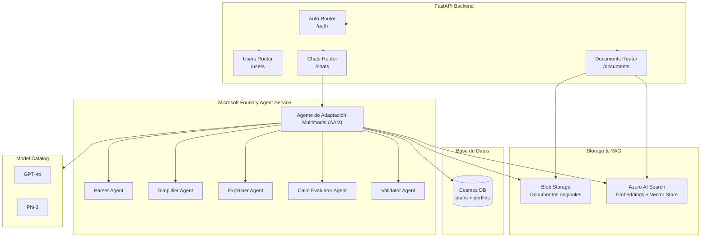

# Arquitectura General – DocSimplify AI (Backend)

El backend está construido con **FastAPI** como capa de API principal.  
Toda la lógica inteligente se orquesta mediante **Microsoft Foundry Agent Service** (multi-agente).  
El flujo principal es conversacional y está impulsado por un pipeline RAG automático.

## Diagrama de Arquitectura

## Componentes Principales

**FastAPI Backend**  

- Framework: FastAPI (Python 3.13+)  
- Autenticación: Entra ID + JWT  
- Routers principales: `/auth`, `/users`, `/documents`, `/chats`

**Agentes (Microsoft Foundry Agent Service)**  

- **Agente de Adaptación Multimodal (AAM)**: Orquestador principal. Recibe mensajes del chat, recupera perfil del usuario y contexto RAG, y coordina todos los agentes.  
- **Parser Agent**: Extrae y limpia texto de documentos.  
- **Simplifier Agent**: Aplica Plain Language según preset y nivel de lectura.  
- **Explainer Agent**: Genera explicaciones calmadas.  
- **Calm Evaluator Agent**: Usa Phi-3 como linter de empatía y tono.  
- **Validator Agent**: Valida WCAG 2.2, Accessibility Insights y Content Safety.

**Almacenamiento y RAG**  

- **Blob Storage**: Almacena los documentos originales (PDF/Word).  
- **Azure AI Search**: Indexa embeddings automáticamente al subir un documento (RAG pipeline).  
- **Cosmos DB**: Almacena usuarios, perfiles dinámicos y historial de fatiga.

**Model Catalog**  

- GPT-4o: Razonamiento y simplificación compleja  
- Phi-3: Evaluación de calma y corrección de tono

**Seguridad e IA Responsable**  

- Entra Agent Identity por agente  
- Content Safety Studio + Responsible AI Toolbox  
- Perfiles nunca viajan completos en prompts  
- Evaluador de Calma siempre activo
