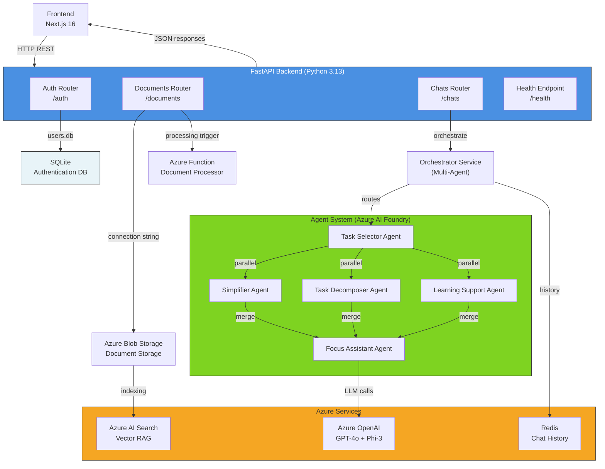
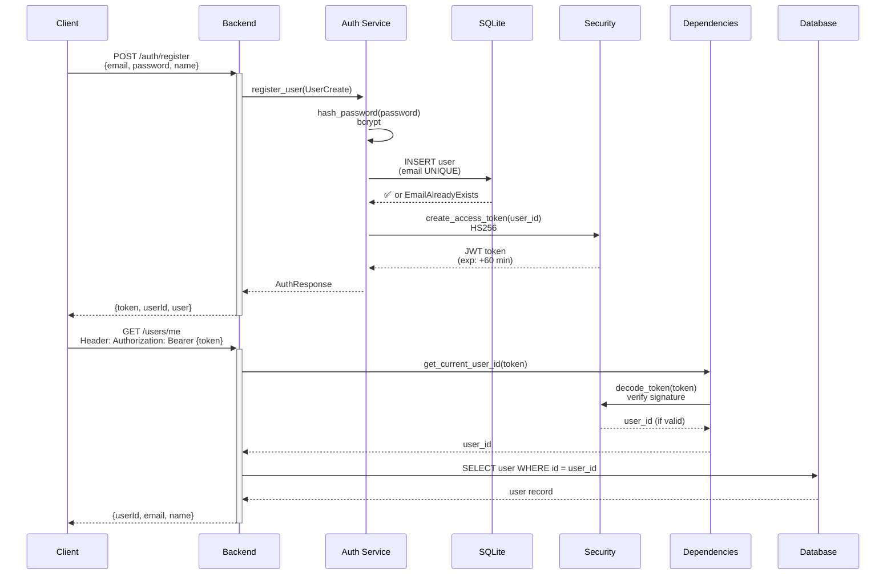
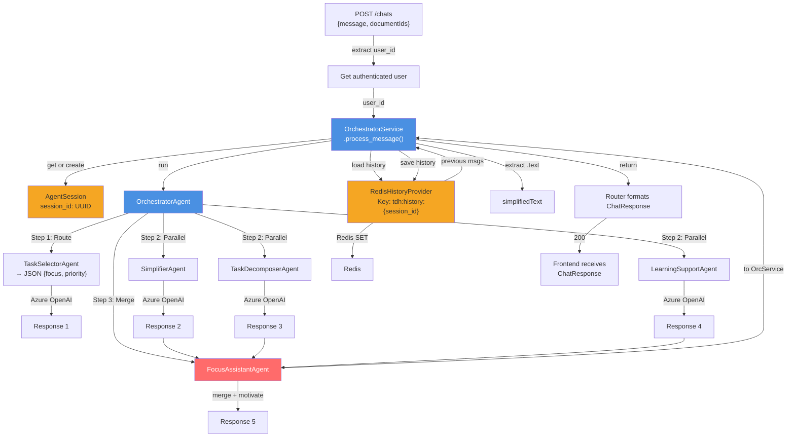
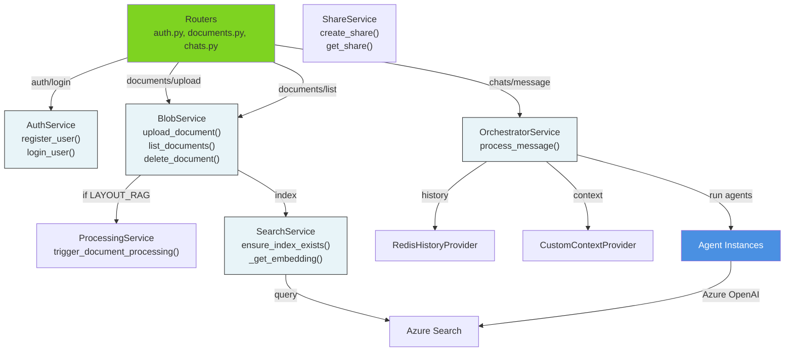

# Brilliant Minds Backend — Comprehensive Technical Documentation

**Documentation Version:** 2.0 (Updated after exhaustive review)  
**Last Updated:** March 2026  
**Status:** Production-Ready with Experimental RAG Modes

---

## Table of Contents

1. [Architecture Overview](#architecture-overview)
2. [Technology Stack](#technology-stack)
3. [FastAPI Structure](#fastapi-structure)
4. [Authentication System](#authentication-system)
5. [API Endpoints Reference](#api-endpoints-reference)
6. [Services Layer](#services-layer)
7. [Data Models & Schemas](#data-models--schemas)
8. [Configuration & Environment](#configuration--environment)
9. [Azure Integrations](#azure-integrations)
10. [Development Setup](#development-setup)
11. [Deployment & Observability](#deployment--observability)

---

## Architecture Overview

### System Diagram



### Core Principles

1. **Async-First**: All I/O operations are non-blocking with `async/await`
2. **Dependency Injection**: Services and credentials managed via FastAPI `Depends()`
3. **Error Propagation**: Custom exceptions for domain errors, HTTP translation at router level
4. **Stateless API**: No session affinity; each request is independent
5. **Neurodiverse-First Design**: Agents optimized for ADHD, ASD, and Dyslexia

---

## Technology Stack

| Component | Technology | Version | Purpose |
|-----------|-----------|---------|---------|
| **Framework** | FastAPI | Latest | RESTful API & async support |
| **Runtime** | Python | 3.13 | Modern async/await, better performance |
| **Authentication** | JWT + bcrypt | - | Stateless auth with secure password hashing |
| **Database (Auth)** | SQLite | 3 | Lightweight user storage |
| **Database (Chat)** | Redis | 7+ | Session history & distributed caching |
| **Cloud Storage** | Azure Blob Storage | - | Document archival |
| **Search & RAG** | Azure AI Search | - | Vector indexing & hybrid search |
| **LLM Calls** | Azure OpenAI + Phi-3 | - | Agent intelligence |
| **Agent Framework** | Azure AI Agent Framework | Latest | Multi-agent orchestration |
| **Form Recognition** | Azure Document Intelligence | - | PDF/image text extraction |

---

## FastAPI Structure

### Entry Point: `src/main.py`

The application bootstrap file sets up core middleware, routers, and health checks.

```python
# Key configuration loaded from src/main.py:
app = FastAPI(
    title="Brilliant Minds AI",
    description="Cognitive-load reduction for neurodiverse learners",
    version="1.0.0"
)

# CORS enabled for frontend origins
app.add_middleware(CORSMiddleware, 
    allow_origins=CORS_ORIGINS,
    allow_credentials=True,
    allow_methods=["GET", "POST", "PUT", "DELETE"],
    allow_headers=["Authorization", "Content-Type"]
)

# Health check
@app.get("/health")
async def health() -> {"status": "ok"}

# API v1 routers
app.include_router(auth_router, prefix="/api/v1")
app.include_router(documents_router, prefix="/api/v1")
app.include_router(chats_router, prefix="/api/v1")
```

### Core Dependencies: `src/core/dependencies.py`

Provides centralized credential and context injection.

```python
async def get_current_user_id(
    credentials: HTTPAuthorizationCredentials = Depends(HTTPBearer())
) -> str:
    """Extract and validate JWT token, return user_id"""
    token = credentials.credentials
    user_id = decode_token(token)  # May raise InvalidCredentialsError
    return user_id
```

**Used in all protected routes:**

```python
@router.get("/dashboard")
async def get_dashboard(
    user_id: str = Depends(get_current_user_id)
) -> Dashboard:
    # Only authenticated users reach this
    profile = await user_service.get_user_profile(user_id)
    return profile
```

---

## Authentication System

### Overview

Brilliant Minds uses **JWT-based stateless authentication** with SQLite persistence.



### Implementation Details

**File:** `src/core/security.py`

```python
from passlib.context import CryptContext
from jose import jwt
from datetime import datetime, timedelta

pwd_context = CryptContext(schemes=["bcrypt"], deprecated="auto")

def hash_password(password: str) -> str:
    """Hash plain-text password with bcrypt (salt included)"""
    return pwd_context.hash(password)

def verify_password(plain: str, hashed: str) -> bool:
    """Verify plain-text matches hashed value"""
    return pwd_context.verify(plain, hashed)

def create_access_token(user_id: str, expires_minutes: int = 60) -> str:
    """Create JWT token with exp claim"""
    payload = {
        "sub": user_id,
        "iat": datetime.utcnow(),
        "exp": datetime.utcnow() + timedelta(minutes=expires_minutes)
    }
    return jwt.encode(
        payload,
        settings.auth_settings.get_secret_key(),
        algorithm="HS256"
    )

def decode_token(token: str) -> str:
    """Extract user_id from JWT, validate signature & expiry"""
    try:
        payload = jwt.decode(
            token,
            settings.auth_settings.get_secret_key(),
            algorithms=["HS256"]
        )
        user_id = payload.get("sub")
        if not user_id:
            raise InvalidCredentialsError("Missing user_id in token")
        return user_id
    except jwt.ExpiredSignatureError:
        raise InvalidCredentialsError("Token expired")
    except jwt.JWTError:
        raise InvalidCredentialsError("Invalid token")
```

**File:** `src/services/auth_service.py`

```python
class AuthService:
    def __init__(self, db_path: str = "data/users.db"):
        self.db = sqlite3.connect(db_path)
        self._init_tables()
    
    def _init_tables(self):
        """Create users table on startup"""
        self.db.execute("""
            CREATE TABLE IF NOT EXISTS users (
                id TEXT PRIMARY KEY,
                email TEXT UNIQUE NOT NULL,
                name TEXT NOT NULL,
                password_hash TEXT NOT NULL,
                created_at TEXT NOT NULL
            )
        """)
        self.db.commit()
    
    async def register_user(self, req: UserCreate) -> AuthResponse:
        """Register new user with hashed password"""
        user_id = uuid.uuid4().hex
        hashed = hash_password(req.password)
        
        try:
            self.db.execute(
                "INSERT INTO users (id, email, name, password_hash, created_at) "
                "VALUES (?, ?, ?, ?, ?)",
                (user_id, req.email, req.name, hashed, datetime.utcnow().isoformat())
            )
            self.db.commit()
        except sqlite3.IntegrityError:
            raise EmailAlreadyExistsError(f"Email {req.email} already registered")
        
        token = create_access_token(user_id)
        return AuthResponse(
            token=token,
            userId=user_id,
            user=AuthUser(userId=user_id, email=req.email, name=req.name)
        )
    
    async def login_user(self, req: UserLogin) -> AuthResponse:
        """Authenticate user and return JWT"""
        user = self.db.execute(
            "SELECT id, email, name, password_hash FROM users WHERE email = ?",
            (req.email,)
        ).fetchone()
        
        if not user:
            raise InvalidCredentialsError("Email not found")
        
        user_id, email, name, password_hash = user
        if not verify_password(req.password, password_hash):
            raise InvalidCredentialsError("Invalid password")
        
        token = create_access_token(user_id)
        return AuthResponse(
            token=token,
            userId=user_id,
            user=AuthUser(userId=user_id, email=email, name=name)
        )
```

---

## API Endpoints Reference

### Auth Router (`/api/v1/auth`)

#### **POST** `/auth/register`

Register a new user account.

**Request:**

```json
{
  "email": "user@example.com",
  "password": "SecurePass123!",
  "name": "John Doe"
}
```

**Response (200):**

```json
{
  "token": "eyJhbGciOiJIUzI1NiIsInR5...",
  "userId": "550e8400e29b41d4a716446655440000",
  "user": {
    "userId": "550e8400e29b41d4a716446655440000",
    "email": "user@example.com",
    "name": "John Doe"
  }
}
```

**Errors:**

- `409 Conflict`: Email already registered (`EmailAlreadyExistsError`)
- `400 Bad Request`: Invalid email format or password < 6 chars
- `500 Internal Server Error`: Database error

---

#### **POST** `/auth/login`

Authenticate and receive JWT token.

**Request:**

```json
{
  "email": "user@example.com",
  "password": "SecurePass123!"
}
```

**Response (200):** Same as register

**Errors:**

- `401 Unauthorized`: Email not found or invalid password
- `500 Internal Server Error`: Database error

---

### Documents Router (`/api/v1/documents`)

#### **POST** `/documents`

Upload a document to Blob Storage and optionally trigger processing.

**Request:**

```
Content-Type: multipart/form-data
Authorization: Bearer {token}

file: (binary PDF, DOCX, DOC, or TXT)
```

**Response (200):**

```json
{
  "success": true,
  "documentId": "a1b2c3d4e5f6",
  "filename": "lecture_notes.pdf",
  "blobName": "user-550e8400e29b41d4a716446655440000/a1b2c3d4e5f6_lecture_notes.pdf",
  "status": "processing"
}
```

**Workflow:**

1. Validate JWT → extract `user_id`
2. Validate MIME type (PDF, DOCX, DOC, TXT)
3. Generate `document_id` (6-byte hex)
4. Upload to Blob Storage: `{user_id}/{document_id}_{filename}`
5. If `LAYOUT_RAG_ENABLED` → trigger Azure Function
6. Return `DocumentUploadResult` with status

**Status values:**

- `uploaded` — File stored, awaiting processing
- `processing` — Document processor running
- `completed` — Ready for RAG
- `error` — Processing failed

---

#### **GET** `/documents`

List all documents for the authenticated user.

**Request:**

```
Authorization: Bearer {token}
```

**Response (200):**

```json
[
  {
    "documentId": "a1b2c3d4e5f6",
    "filename": "lecture_notes.pdf",
    "blobName": "user-550e8400e29b41d4a716446655440000/a1b2c3d4e5f6_lecture_notes.pdf",
    "status": "completed"
  },
  {
    "documentId": "f6e5d4c3b2a1",
    "filename": "textbook_ch3.docx",
    "blobName": "user-550e8400e29b41d4a716446655440000/f6e5d4c3b2a1_textbook_ch3.docx",
    "status": "processing"
  }
]
```

---

#### **DELETE** `/documents/{documentId}`

Delete a document and remove from Blob Storage.

**Request:**

```
Authorization: Bearer {token}
```

**Response (200):**

```json
{
  "status": "deleted",
  "documentId": "a1b2c3d4e5f6"
}
```

---

### Chats Router (`/api/v1/chats`)

#### **POST** `/chats`

Send a message to the orchestrator agent and receive a simplified response.

**This is the primary endpoint for the Brilliant Minds experience.**

**Request:**

```json
{
  "message": "Explain photosynthesis in simple terms",
  "documentIds": ["a1b2c3d4e5f6"],
  "fatigueLevel": 0,
  "targetLanguage": null
}
```

**Response (200):**

```json
{
  "simplifiedText": "Plants use sunlight to make food.\n\n1. Leaf captures light\n2. Water enters roots\n3. CO₂ enters leaf\n4. Plant makes sugar for energy",
  "explanation": "Think of it like cooking... but with sunlight instead of heat.",
  "tone": "calm_supportive",
  "readingLevelUsed": "A2",
  "glossary": [
    { "word": "photosynthesis", "definition": "How plants turn light into food" },
    { "word": "CO₂", "definition": "Carbon dioxide — air we breathe out" }
  ],
  "visualReferences": [
    {
      "type": "diagram",
      "url": "https://...",
      "caption": "Plant parts needed for photosynthesis"
    }
  ],
  "audioUrl": null,
  "wcagReport": {
    "score": 95,
    "passed": true,
    "issues": []
  }
}
```

**Orchestration Flow Inside:**



**Field Meanings:**

- `fatigueLevel` (0-2): User cognitive state (0=fresh, 2=exhausted) — agents adapt reading level
- `targetLanguage`: Optional language code (e.g., "es") for translation
- `audioUrl`: URL to audio version (if generated)
- `wcagReport`: Accessibility compliance check

---

## Services Layer

### Architecture

All business logic lives in services under `src/services/`. Each service:

- Exposes `async` functions
- Raises custom exceptions (not generic Python errors)
- Logs all operations with context (user_id, request_id)
- Uses dependency injection for external clients



### Key Services

#### **AuthService** (`src/services/auth_service.py`)

Manages user registration and authentication.

| Method | Parameters | Returns | Raises |
|--------|-----------|---------|--------|
| `register_user()` | `UserCreate` | `AuthResponse` | `EmailAlreadyExistsError` |
| `login_user()` | `UserLogin` | `AuthResponse` | `InvalidCredentialsError` |
| `get_user()` | `user_id: str` | `AuthUser` | `UserNotFoundError` |

---

#### **BlobService** (`src/services/blob_service.py`)

Manages document uploads, downloads, and metadata.

```python
async def upload_document(
    file_bytes: bytes,
    filename: str,
    user_id: str,
    document_id: str
) -> str:
    """Upload document to blob storage.
    
    Args:
        file_bytes: Binary file content
        filename: Original filename
        user_id: Document owner
        document_id: Unique ID
    
    Returns:
        blob_url (https://storage.../blob_name)
    
    Flow:
        1. Generate blob_name: {user_id}/{document_id}_{filename}
        2. Upload via BlobServiceClient
        3. Return blob_url
    """
    blob_client = self.client.get_blob_client(
        container=self.container_name,
        blob=blob_name
    )
    await blob_client.upload_blob(file_bytes, overwrite=True)
    return blob_client.url

async def list_documents(user_id: str) -> list[DocumentItem]:
    """List all documents owned by user"""
    container_client = self.client.get_container_client(self.container_name)
    items = []
    async for blob in container_client.list_blobs(name_starts_with=f"{user_id}/"):
        # Parse: user-id/document-id_filename
        parts = blob.name.split("/")[1].split("_", 1)
        document_id, filename = parts[0], parts[1] if len(parts) > 1 else blob.name
        items.append(DocumentItem(
            documentId=document_id,
            filename=filename,
            blobName=blob.name,
            status="completed"  # or fetch from metadata
        ))
    return items
```

---

#### **SearchService** (`src/services/search_service.py`)

Manages Azure AI Search indexes and RAG retrieval.

```python
async def ensure_index_exists() -> None:
    """Create vector index if not exists"""
    try:
        index_client.get_index(self.index_name)
    except ResourceNotFoundError:
        # Create new index with embedding field
        fields = [
            SimpleField("id", SearchFieldDataType.String,
                       key=True, sortable=True),
            SearchField("content", SearchFieldDataType.String,
                       searchable=True, retrievable=True),
            SearchField("embedding", SearchFieldDataType.Collection(
                       SearchFieldDataType.Single),
                       searchable=True,
                       vector_search_dimensions=1536,
                       vector_search_profile_name="myHnswProfile")
        ]
        index = SearchIndex(name=self.index_name, fields=fields, ...)
        index_client.create_index(index)

async def _get_embedding(text: str) -> list[float]:
    """Get embedding from Azure OpenAI"""
    response = await openai_client.embeddings.create(
        input=text,
        model=self.embedding_deployment_name
    )
    return response.data[0].embedding
```

---

#### **OrchestratorService** (`src/agents/orchestrator_service.py`)

Coordinates the multi-agent system for document simplification.

```python
class OrchestratorService:
    def __init__(self):
        self.orchestrator = OrchestratorAgent()
        self.user_sessions: Dict[str, AgentSession] = {}
    
    async def get_or_create_session(self, user_id: str) -> AgentSession:
        """Get persistent session or create new one"""
        if user_id not in self.user_sessions:
            self.user_sessions[user_id] = AgentSession(
                session_id=uuid.uuid4().hex,
                user_id=user_id,
                state={},
                history=[]
            )
        return self.user_sessions[user_id]
    
    async def process_message(self, user_id: str, user_message: str) -> str:
        """Process user message through agent pipeline"""
        session = await self.get_or_create_session(user_id)
        
        # Run orchestrator with session context
        response = await self.orchestrator.run(user_message, session)
        
        # Extract text from response object
        result_text = self._extract_text(response)
        
        return result_text
    
    def _extract_text(self, response):
        """Normalize response from various agent formats"""
        if hasattr(response, "text"):
            return response.text.strip()
        if hasattr(response, "messages"):
            return response.messages[-1].text.strip()
        return str(response).strip()
```

---

## Data Models & Schemas

All request/response models use **Pydantic v2** with `populate_by_name=True` to support both snake_case (Python) and camelCase (JSON).

### Base Model (`src/models/schemas/base.py`)

```python
from pydantic import BaseModel, ConfigDict

class ApiModel(BaseModel):
    """All API models inherit this to enable camelCase aliases"""
    model_config = ConfigDict(populate_by_name=True)
```

### Auth Models (`src/models/schemas/auth.py`)

```python
class UserCreate(ApiModel):
    """Register new user"""
    email: str = Field(..., min_length=5, pattern=r"^[\w.-]+@[\w.-]+\.\w+$")
    password: str = Field(..., min_length=6)
    name: str = Field(..., min_length=1, max_length=100)

class UserLogin(ApiModel):
    """Login request"""
    email: str
    password: str

class AuthUser(ApiModel):
    """User object in auth response"""
    userId: str = Field(..., alias="user_id")
    email: str
    name: str

class AuthResponse(ApiModel):
    """Response from /auth/login or /auth/register"""
    token: str
    userId: str = Field(..., alias="user_id")
    user: AuthUser
```

### Document Models (`src/models/schemas/documents.py`)

```python
DocumentStatus = Literal["uploaded", "processing", "completed", "error"]

class DocumentItem(ApiModel):
    """Single document metadata"""
    documentId: str = Field(..., alias="document_id")
    filename: str
    blobName: Optional[str] = Field(None, alias="blob_name")
    status: DocumentStatus

class DocumentUploadResult(DocumentItem):
    """Response from POST /documents"""
    success: bool = True
```

### Chat Models (`src/models/schemas/chats.py`)

```python
class ChatMessage(ApiModel):
    """User's message to agent"""
    message: str = Field(..., min_length=1, max_length=2000)
    documentIds: Optional[list[str]] = Field(None, alias="document_ids")
    fatigueLevel: Optional[int] = Field(0, ge=0, le=2, alias="fatigue_level")
    targetLanguage: Optional[str] = Field(None, alias="target_language")

class GlossaryEntry(ApiModel):
    """Definition of difficult term"""
    word: str
    definition: str
    context: Optional[str] = None

class VisualReference(ApiModel):
    """Link to diagram or image"""
    type: str  # "diagram", "chart", "photo", etc.
    url: str
    caption: str

class WcagReport(ApiModel):
    """WCAG 2.2 accessibility check"""
    score: int = Field(..., ge=0, le=100)
    passed: bool
    issues: list[str] = []

class ChatResponse(ApiModel):
    """Response from POST /chats"""
    simplifiedText: str = Field(..., alias="simplified_text")
    explanation: str
    tone: str  # "calm_supportive", "neutral_clear"
    readingLevelUsed: Optional[str] = Field(None, alias="reading_level_used")
    glossary: Optional[list[GlossaryEntry]] = []
    visualReferences: Optional[list[VisualReference]] = Field(None, alias="visual_references")
    audioUrl: Optional[str] = Field(None, alias="audio_url")
    wcagReport: Optional[WcagReport] = Field(None, alias="wcag_report")
```

---

## Configuration & Environment

### Settings Structure (`src/config/settings.py`)

All configuration is loaded from environment variables with validation and sensible defaults.

```python
from pydantic_settings import BaseSettings

class AuthSettings(BaseSettings):
    """JWT & SQLite auth config"""
    SECRET_KEY: str = Field(default="change-me-in-production")
    ALGORITHM: str = "HS256"
    EXPIRE_MINUTES: int = 60
    ALLOW_INSECURE_DEV_SECRET: bool = False
    
    def get_secret_key(self) -> str:
        if self.SECRET_KEY == "change-me-in-production" and not self.ALLOW_INSECURE_DEV_SECRET:
            raise ValueError("Set JWT_SECRET_KEY before production use")
        return self.SECRET_KEY

class BlobStorageSettings(BaseSettings):
    """Azure Blob Storage config"""
    CONNECTION_STRING: str
    CONTAINER_NAME: str = "documents"
    ACCOUNT_URL: Optional[str] = None
    
    def validate(self) -> None:
        if not self.CONNECTION_STRING:
            raise ValueError("AZURE_STORAGE_CONNECTION_STRING required")

class AISearchSettings(BaseSettings):
    """Azure AI Search (vector RAG) config"""
    ENDPOINT: str
    KEY: str
    INDEX_NAME: str = "doc-simplify-index"
    EMBEDDING_DIMENSIONS: int = 1536

class AzureOpenAISettings(BaseSettings):
    """Azure OpenAI LLM config"""
    ENDPOINT: str
    KEY: str
    DEPLOYMENT_NAME: str  # Chat model
    AI_MODEL_NAME: str = "gpt-4o"
    EMBEDDING_DEPLOYMENT_NAME: str = "text-embedding-3-small"

class AgentSettings(BaseSettings):
    """Agent Framework config"""
    AZURE_AI_PROJECT_ENDPOINT: str
    AZURE_OPENAI_RESPONSES_DEPLOYMENT_NAME: str

class RedisSettings(BaseSettings):
    """Redis chat history"""
    URL: str = "redis://localhost:6379"
    
    def get_redis_url(self) -> str:
        return self.URL

class Settings(BaseSettings):
    """Root settings combining all sub-configs"""
    auth_settings: AuthSettings
    blob_settings: BlobStorageSettings
    search_settings: AISearchSettings
    openai_settings: AzureOpenAISettings
    agent_settings: AgentSettings
    redis_settings: RedisSettings
    
    CORS_ORIGINS: list[str] = [
        "http://localhost:3000",
        "http://localhost:8000"
    ]
    ENVIRONMENT: str = "development"

settings = Settings()  # Load from .env automatically
```

### Required Environment Variables

Create a `.env` file in the project root before running:

```bash
# Authentication
JWT_SECRET_KEY=your-super-secret-key-here
JWT_ALGORITHM=HS256
JWT_EXPIRE_MINUTES=60
ALLOW_INSECURE_DEV_SECRET=true  # ONLY for development

# Database
AUTH_DB_PATH=data/users.db

# Blob Storage
AZURE_STORAGE_CONNECTION_STRING=DefaultEndpointsProtocol=https;AccountName=...
AZURE_STORAGE_CONTAINER=documents
AZURE_STORAGE_ACCOUNT_URL=https://youraccountname.blob.core.windows.net/

# Azure AI Search (RAG)
AI_SEARCH_ENDPOINT=https://search-resource.search.windows.net
AI_SEARCH_KEY=your-search-api-key
AI_SEARCH_INDEX_NAME=doc-simplify-index

# Azure OpenAI (LLM)
AOAI_ENDPOINT=https://resource-name.openai.azure.com/
AOAI_KEY=your-openai-api-key
AOAI_DEPLOYMENT_NAME=gpt-4o-deployment
AI_MODEL_NAME=gpt-4o
EMBEDDING_DEPLOYMENT_NAME=text-embedding-3-small

# Agent Framework
AZURE_AI_PROJECT_ENDPOINT=https://resource-name.api.azureml-test.net
AZURE_OPENAI_RESPONSES_DEPLOYMENT_NAME=gpt-4o-responses

# Redis (Chat History)
REDIS_URL=redis://localhost:6379

# CORS
CORS_ORIGINS=http://localhost:3000,http://localhost:8000

# Environment
ENVIRONMENT=development
```

---

## Azure Integrations

### Authentication & Credentials

All Azure services use `DefaultAzureCredential`, which tries (in order):

1. Environment variables (`AZURE_*`)
2. Visual Studio Code authentication
3. Azure CLI (`az` command-line)
4. Managed Identity (in production on Azure resources)

```python
from azure.identity import DefaultAzureCredential

credential = DefaultAzureCredential()
# Automatically finds credentials in dev or production
```

### Blob Storage

```python
from azure.storage.blob.aio import BlobServiceClient

client = BlobServiceClient.from_connection_string(
    connection_string=settings.blob_settings.CONNECTION_STRING
)

# Upload document
container_client = client.get_container_client("documents")
blob_client = container_client.get_blob_client("user-123/doc-abc_lecture.pdf")
await blob_client.upload_blob(file_bytes, overwrite=True)
```

### Azure AI Search (Vector RAG)

```python
from azure.search.documents.aio import SearchClient
from azure.search.documents.indexes.aio import SearchIndexClient

# Create or get index
index_client = SearchIndexClient(
    endpoint=settings.search_settings.ENDPOINT,
    credential=credential
)
index = index_client.get_index(settings.search_settings.INDEX_NAME)

# Query documents
search_client = SearchClient(
    endpoint=settings.search_settings.ENDPOINT,
    index_name=settings.search_settings.INDEX_NAME,
    credential=credential
)
results = search_client.search(
    search_text="photosynthesis",
    vector=embedding,
    k=10  # Top 10 results
)
```

### Azure OpenAI (LLM)

```python
from openai import AzureOpenAI

client = AzureOpenAI(
    endpoint=settings.openai_settings.ENDPOINT,
    api_key=settings.openai_settings.KEY,
    api_version="2024-02-15-preview"
)

response = client.chat.completions.create(
    model=settings.openai_settings.DEPLOYMENT_NAME,
    messages=[
        {"role": "system", "content": "Simplify for ADHD learners"},
        {"role": "user", "content": "Explain photosynthesis"}
    ]
)
print(response.choices[0].message.content)
```

---

## Development Setup

### Prerequisites

- **Python:** 3.13+
- **pip:** Latest version
- **Git:** For version control

### Installation

```bash
# Clone repository
git clone https://github.com/yourusername/brilliant-minds
cd brilliant-minds

# Create virtual environment
python -m venv venv
source venv/bin/activate  # Linux/Mac
# OR
venv\Scripts\activate  # Windows

# Install dependencies in editable mode
pip install -e .

# This installs the package + its dependencies from pyproject.toml
# The `-e` flag means editable, so changes to src/ are immediately reflected
```

### Running the Backend

```bash
# Start FastAPI dev server with auto-reload
python -m uvicorn src.main:app --host 0.0.0.0 --port 8001 --reload

# The --reload flag watches for file changes and restarts the server
# API will be available at http://localhost:8001
# Swagger UI docs at http://localhost:8001/docs
# ReDoc docs at http://localhost:8001/redoc
```

### Testing

```bash
# Run all tests
python -m pytest

# Run specific test file
python -m pytest tests/test_auth_service.py -v

# Run specific test function
python -m pytest tests/test_auth_service.py::test_register_and_login -vv

# Run with coverage
python -m pytest --cov=src --cov-report=html

# Run with live output
python -m pytest -s -vv
```

### Database Reset (Development Only)

```bash
# Remove auth database
rm data/users.db

# Next run will recreate it
python -m uvicorn src.main:app --reload
```

---

## Deployment & Observability

### Logging

All services log with context via Python's `logging` module:

```python
import logging

logger = logging.getLogger(__name__)

async def process_message(user_id: str, message: str):
    logger.info(
        "Processing message",
        extra={
            "user_id": user_id,
            "message_length": len(message),
            "service": "orchestrator"
        }
    )
    try:
        result = await orchestrator.run(message)
        logger.info("Message processed successfully", extra={"user_id": user_id})
        return result
    except Exception as e:
        logger.error(
            f"Message processing failed: {e}",
            extra={"user_id": user_id},
            exc_info=True
        )
        raise
```

### Health Check

```bash
# Simple health check
curl http://localhost:8001/health
# {"status":"ok"}
```

### Production Checklist

- [ ] Set `ENVIRONMENT=production`
- [ ] Use strong `JWT_SECRET_KEY` (64+ random characters)
- [ ] Enable HTTPS (use reverse proxy like nginx)
- [ ] Configure `CORS_ORIGINS` to only allow your frontend domain
- [ ] Use Azure Key Vault for secrets (not .env)
- [ ] Enable Azure Monitor for logging
- [ ] Set up alerts for API errors
- [ ] Load test with expected traffic
- [ ] Document API breaking changes in release notes

---

## Troubleshooting

### Common Issues

**Q: "Email already registered" on new account**

- A: Check SQLite database doesn't have leftover data from previous run
- Solution: `rm data/users.db && restart`

**Q: JWT token expired immediately**

- A: Check `JWT_SECRET_KEY` changed between requests (would cause decode failure)
- Solution: Keep secret consistent, check env vars

**Q: Azure services return 401**

- A: Credentials not found by `DefaultAzureCredential`
- Solution: Run `az login` or set environment `AZURE_*` variables

**Q: Vector search returns no results**

- A: Index may be empty or dimensions mismatch
- Solution: Re-upload documents, check `EMBEDDING_DIMENSIONS` matches model output

---

## Summary

Brilliant Minds backend is built on:

- **FastAPI** for rapid, async API development
- **SQLite** for simple auth persistence
- **Azure services**for scaling (Search, OpenAI, Blob Storage, Agents)
- **Multi-agent orchestration** for neurodiverse-optimized responses
- **JWT + bcrypt** for stateless, secure authentication

The architecture prioritizes **clarity**, **scalability**, and **cognitive accessibility** for end users.
