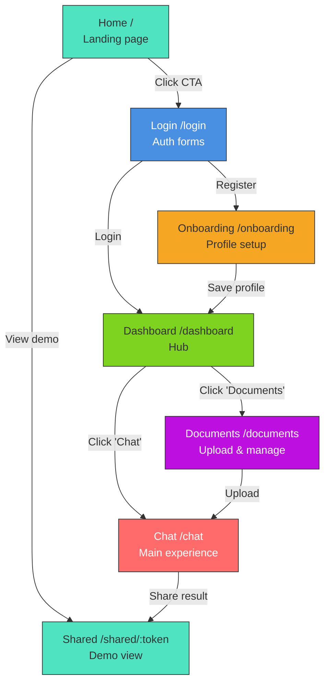
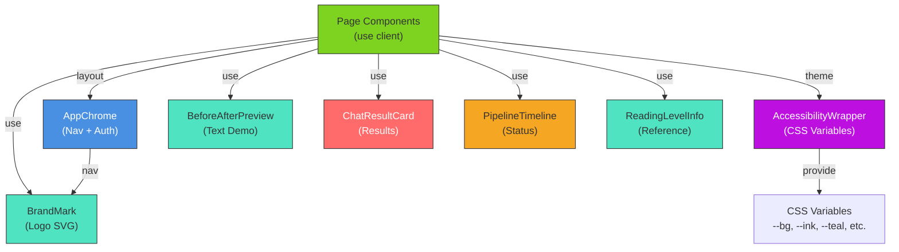

# Brilliant Minds Frontend — Comprehensive Technical Documentation

**Documentation Version:** 2.0 (Updated after exhaustive review)  
**Last Updated:** March 2026  
**Framework:** Next.js 16 + React 18 + TypeScript  
**Status:** MVP Complete with Mock API Fallback

---

## Table of Contents

1. [Architecture Overview](#architecture-overview)
2. [Project Structure](#project-structure)
3. [Page Routing & Navigation](#page-routing--navigation)
4. [Component System](#component-system)
5. [Styling & Theming](#styling--theming)
6. [State Management](#state-management)
7. [API Communication](#api-communication)
8. [Type System](#type-system)
9. [Development Setup](#development-setup)
10. [Deployment](#deployment)

---

## Architecture Overview

### High-Level System Diagram

```mermaid
graph TB
    subgraph NextJS["Next.js 16 App Router"]
        Layout["🏗️ RootLayout<br/>app/layout.tsx"]
        
        Pages["📄 Page Components<br/>(use client)"]
        
        Home["🏠 Home /"]
        Login["🔑 Login /login"]
        Onboarding["⚙️ Onboarding /onboarding"]
        Dashboard["📊 Dashboard /dashboard"]
        Documents["📁 Documents /documents"]
        Chat["💬 Chat /chat"]
        Shared["🔗 Shared /shared/[token]"]
        
        Pages --> Home
        Pages --> Login
        Pages --> Onboarding
        Pages --> Dashboard
        Pages --> Documents
        Pages --> Chat
        Pages --> Shared
    end
    
    subgraph Providers["Context & Providers"]
        UserProvider["🔐 UserProvider<br/>useUser() hook"]
        AccessibilityWrapper["🎨 AccessibilityWrapper<br/>Theme/Tone/Density"]
    end
    
    subgraph Components["🧩 Component Library"]
        AppChrome["AppChrome<br/>Nav + Auth"]
        BrandMark["BrandMark<br/>Logo"]
        BeforeAfterPreview["BeforeAfterPreview<br/>Demo"]
        ChatResultCard["ChatResultCard<br/>Results + Share"]
        PipelineTimeline["PipelineTimeline<br/>Status"]
        ReadingLevelInfo["ReadingLevelInfo<br/>Reference"]
    end
    
    subgraph StateLib["State & Utils"]
        Types["lib/types.ts<br/>TypeScript definitions"]
        Profile["lib/profile.ts<br/>Palette & levels"]
        API["lib/api.ts<br/>API client + mock"]
    end
    
    subgraph Styling["🎨 Styling"]
        Tailwind["Tailwind CSS<br/>utility classes"]
        GlobalCSS["globals.css<br/>CSS variables + themes"]
    end
    
    Layout --> UserProvider
    Layout --> AccessibilityWrapper
    Layout --> AppChrome
    Layout --> Pages
    
    Pages -->|fetch/cache| API
    API -->|with mock| StateLib
    
    Components -->|import| Pages
    Components -->|use| Types
    Components -->|apply theme| Tailwind
    
    Tailwind -->|colors| GlobalCSS
    AccessibilityWrapper -->|sets| GlobalCSS
    
    API -->|calls| Backend["FastAPI Backend<br/>localhost:8001"]
    API -->|fallback mock| MockAPI["Mock API<br/>localStorage"]
    
    style NextJS fill:#000,stroke:#fff,color:#fff
    style Providers fill:#4A90E2,stroke:#333,color:#fff
    style Components fill:#7ED321,stroke:#333
    style StateLib fill:#F5A623,stroke:#333
    style Styling fill:#BD10E0,stroke:#333,color:#fff
```



### Core Principles

1. **Server Components by Default**: All pages are Server Components unless they need interactivity → mark with `"use client"`
2. **Context for Shared State**: User auth/profile via Context, not Redux/Zustand
3. **Accessibility-First Styling**: CSS variables for neurodiverse themes, not hard-coded colors
4. **Mock API by Default**: Demo mode works offline; real API is opt-in via `.env.local`
5. **Type Safety**: 100% TypeScript coverage for props and state

---

## Project Structure

### Directory Organization

```
frontend/
├── app/                              # Next.js 13+ App Router
│   ├── globals.css                  # Global styles + CSS variables
│   ├── layout.tsx                   # Root layout (UserProvider, Accessibility)
│   ├── page.tsx                     # Home / (Palace selector + CTA)
│   ├── login/
│   │   └── page.tsx                 # Login & register forms
│   ├── onboarding/
│   │   └── page.tsx                 # Profile setup (accessibility + levels)
│   ├── dashboard/
│   │   └── page.tsx                 # Hub after auth
│   ├── documents/
│   │   └── page.tsx                 # Upload + manage documents
│   ├── chat/
│   │   └── page.tsx                 # Chat interface + result cards
│   └── shared/
│       └── [token]/
│           └── page.tsx             # Public result sharing
│
├── components/                       # Reusable UI components (presentational)
│   ├── AccessibilityWrapper.tsx     # Theme provider + CSS vars
│   ├── AppChrome.tsx                # Navigation bar + auth UI
│   ├── BrandMark.tsx                # Brain SVG logo
│   ├── BeforeAfterPreview.tsx       # Before/after text demo
│   ├── ChatResultCard.tsx           # Result display + actions
│   ├── PipelineTimeline.tsx         # Processing status
│   └── ReadingLevelInfo.tsx         # Level reference card
│
├── context/                          # React Context providers
│   └── UserContext.tsx              # AuthUser + Profile + Token
│
├── lib/                              # Utilities, types, API
│   ├── types.ts                     # Comprehensive TypeScript interfaces
│   ├── profile.ts                   # Palette palettes, reading levels
│   └── api.ts                       # API client + mock system
│
├── next.config.ts                   # Next.js configuration (minimal)
├── tsconfig.json                    # TypeScript paths (@ alias ready)
├── tailwind.config.js               # Tailwind CSS theme config
├── postcss.config.js                # CSS processing
├── package.json                     # Dependencies & npm scripts
└── README.md                         # Quick start guide
```

### Key Files Explained

| File | Purpose | Key Content |
|------|---------|------------|
| `app/layout.tsx` | Root layout wrapping all pages | Providers, AppChrome, auth check |
| `app/globals.css` | Global styles + design system | CSS variables for colors, spacing, themes |
| `lib/types.ts` | Central type definitions | ReadingLevel, AccessibilityPreset, UserProfile |
| `lib/profile.ts` | Palette & accessibility data | Palettes, reading levels, intensity mapping |
| `lib/api.ts` | API client + mock system | requestJson(), login(), sendMessage(), etc. |
| `context/UserContext.tsx` | Global user state | Token, authUser, profile, localStorage sync |

---

## Page Routing & Navigation

### Page Hierarchy



### Page Details

#### **Home** / — `app/page.tsx`

**Purpose:** Landing page with palette selector and authentication entry point.

**Key Features:**

- Palette selector (Neutral, Calm, Contrast, Harmony)
- Call-to-action buttons: "Empezar" (Login/Register), "Ver ejemplo" (Demo)
- Brain logo animation (BrandMark component)
- Accessible color contrast validation

**Component Tree:**

```tsx
export default function Home() {
  const [selectedPalette, setSelectedPalette] = useState("neutral");
  
  return (
    <main className="min-h-screen flex flex-col">
      <BrandMark showTagline />
      <PaletteSelector value={selectedPalette} onChange={setSelectedPalette} />
      <button onClick={() => router.push("/login")}>
        Empezar
      </button>
      <button onClick={() => router.push("/shared/demo-token")}>
        Ver ejemplo
      </button>
    </main>
  );
}
```

---

#### **Login** /login — `app/login/page.tsx`

**Purpose:** Unified authentication (register + login) with JWT token handling.

**Features:**

- Toggle between Register and Login modes
- Email + password validation
- Client-side error display
- Redirect on success → `/onboarding` (new user) or `/dashboard` (returning)

**User Flow:**

```tsx
const [mode, setMode] = useState<"login" | "register">("login");
const [email, setEmail] = useState("");
const [password, setPassword] = useState("");
const [name, setName] = useState("");
const [error, setError] = useState("");
const [loading, setLoading] = useState(false);

async function handleSubmit() {
  setLoading(true);
  try {
    const response = mode === "login"
      ? await login({ email, password })
      : await register({ email, password, name });
    
    // Redirect based on profile existence
    const hasProfile = await checkProfile();
    router.push(hasProfile ? "/dashboard" : "/onboarding");
  } catch (err) {
    setError(err.message);
  } finally {
    setLoading(false);
  }
}
```

---

#### **Onboarding** /onboarding — `app/onboarding/page.tsx`

**Purpose:** First-time user setup of accessibility preferences.

**Collects:**

- Cognitive condition: ADHD, Dyslexia, Combined, Manual
- Reading level: A1, A2, B1, C1
- Intensity: Light, Balanced, Strong
- Tone: Calm (supportive), Neutral (clear)
- Priorities: Focus, Calm, Contrast, Short Sentences, Step-by-Step

**State Storage:**  
Saves to `ExperienceDraft` in localStorage, which becomes the active `UserProfile`.

**Example Update:**

```tsx
async function handleSave() {
  const profile: ExperienceDraft = {
    palettePreference: "calm",
    condition: "adhd",
    readingLevel: "B1",
    intensity: "balanced",
    maxSentenceLength: 12,
    tone: "calm_supportive",
    priorities: ["focus", "calm", "short_sentences"]
  };
  
  writeExperienceDraft(profile);
  setProfile(profile);  // Update context
  router.push("/dashboard");
}
```

---

#### **Dashboard** /dashboard — `app/dashboard/page.tsx`

**Purpose:** Hub for authenticated users after onboarding.

**Shows:**

- User greeting (name)
- Palette theme switcher
- Links to Documents and Chat
- Hero section with palette-driven styling

**Auth Guard:**

```tsx
export default function Dashboard() {
  const { isAuthenticated, profile } = useUser();
  const router = useRouter();
  
  useEffect(() => {
    if (!isAuthenticated) {
      router.replace("/login");  // Redirect if not authenticated
    }
    if (!profile) {
      router.replace("/onboarding");  // Redirect if no profile
    }
  }, [isAuthenticated, profile]);
  
  return (
    <section className="theme-{palette} tone-{tone}">
      <h1>Welcome, {authUser?.name}!</h1>
      <nav>
        <Link href="/documents">Upload Documents</Link>
        <Link href="/chat">Start Chat</Link>
      </nav>
    </section>
  );
}
```

---

#### **Documents** /documents — `app/documents/page.tsx`

**Purpose:** Upload documents and monitor processing status.

**Features:**

- File input (PDF, DOCX, DOC, TXT)
- Document list with status badges
- Delete action
- Process pipeline animation (PipelineTimeline)

**State:**

```tsx
const [file, setFile] = useState<File | null>(null);
const [documents, setDocuments] = useState<DocumentItem[]>([]);
const [uploading, setUploading] = useState(false);
const [result, setResult] = useState<DocumentUploadResult | null>(null);

async function handleUpload() {
  setUploading(true);
  try {
    const result = await uploadDocument(file);
    setResult(result);
    
    // Poll for status updates
    const pollStatus = setInterval(async () => {
      const updated = await listDocuments();
      const doc = updated.find(d => d.documentId === result.documentId);
      if (doc?.status === "completed") {
        clearInterval(pollStatus);
      }
      setDocuments(updated);
    }, 2000);
  } finally {
    setUploading(false);
  }
}
```

---

#### **Chat** /chat — `app/chat/page.tsx`

**Purpose:** Main user experience — chat interface with agent responses.

**Features:**

- Document selector dropdown
- Message input with suggestions
- Result cards (ChatResultCard)
- Share functionality
- Before/After preview (BeforeAfterPreview)

**Conversation Flow:**

```tsx
const [messages, setMessages] = useState<ChatMessage[]>([]);
const [input, setInput] = useState("");
const [documents, setDocuments] = useState<DocumentItem[]>([]);
const [selectedDocIds, setSelectedDocIds] = useState<string[]>([]);
const [isSending, setIsSending] = useState(false);

async function handleSendMessage() {
  setIsSending(true);
  
  const userMessage: ChatMessage = {
    id: uuid(),
    role: "user",
    text: input
  };
  
  setMessages(prev => [...prev, userMessage]);
  setInput("");
  
  try {
    const response = await sendChatMessage({
      message: input,
      documentIds: selectedDocIds,
      fatigueLevel: 0
    });
    
    const assistantMessage: ChatMessage = {
      id: uuid(),
      role: "assistant",
      response  // ChatResponse object
    };
    
    setMessages(prev => [...prev, assistantMessage]);
  } finally {
    setIsSending(false);
  }
}
```

---

#### **Shared** /shared/[token] — `app/shared/[token]/page.tsx`

**Purpose:** Public view of shared chat results (no auth required).

**Features:**

- Display simplified text + explanation
- Glossary + visual references
- WCAG report badge
- "Copy" and "Share" buttons

**Fetch Shared Result:**

```tsx
export default function SharedPage({ params }) {
  const [result, setResult] = useState<ChatResponse | null>(null);
  
  useEffect(() => {
    const response = await getSharedResult(params.token);
    setResult(response);
  }, [params.token]);
  
  if (!result) return <div>Loading...</div>;
  
  return (
    <article>
      <h1>Simplified Content</h1>
      <div>{result.simplifiedText}</div>
      <ChatResultCard response={result} />
    </article>
  );
}
```

---

## Component System

### Component Architecture



### Component Reference

#### **AccessibilityWrapper** — `components/AccessibilityWrapper.tsx`

**Purpose:** Apply dynamic theme classes and CSS variables based on user profile.

**Props:**

```tsx
interface AccessibilityWrapperProps {
  children: ReactNode;
}
```

**Functionality:**

```tsx
export function AccessibilityWrapper({ children }: AccessibilityWrapperProps) {
  const { profile } = useUser();
  const draft = readExperienceDraft();
  
  // Determine which theme to apply
  const paletteTheme = profile?.palettePreference || draft.palettePreference;
  const toneClass = profile?.tone === "calm_supportive" ? "tone-calm" : "tone-neutral";
  const densityClass = getDensityClass(profile?.maxSentenceLength);
  
  const className = `${paletteTheme} ${toneClass} ${densityClass}`;
  
  return (
    <div className={className}>
      {children}
    </div>
  );
}

function getDensityClass(maxLength?: number): string {
  if (!maxLength || maxLength <= 8) return "density-compact";
  if (maxLength <= 12) return "density-balanced";
  return "density-relaxed";
}
```

---

#### **AppChrome** — `components/AppChrome.tsx`

**Purpose:** Navigation bar with auth state and palette switcher.

**Props:**

```tsx
interface AppChromeProps {
  children: ReactNode;
}
```

**Features:**

- Navbar with logo
- Palette switcher dropdown
- Auth menu (Profile, Logout)
- Responsive mobile nav

**Example:**

```tsx
export function AppChrome({ children }: AppChromeProps) {
  const { isAuthenticated, authUser, logout } = useUser();
  const draft = readExperienceDraft();
  
  return (
    <div>
      <nav className="flex justify-between items-center p-4">
        <Link href="/">
          <BrandMark compact />
        </Link>
        
        <select
          value={draft.palettePreference}
          onChange={(e) => updatePalette(e.target.value)}
          className="bg-[var(--panel)] text-[var(--ink)]"
        >
          <option>Neutral</option>
          <option>Calm</option>
          <option>Contrast</option>
          <option>Harmony</option>
        </select>
        
        {isAuthenticated && (
          <button onClick={logout}>Logout {authUser?.name}</button>
        )}
      </nav>
      
      {children}
    </div>
  );
}
```

---

#### **BrandMark** — `components/BrandMark.tsx`

**Purpose:** Animated brain logo with gradient.

**Props:**

```tsx
interface BrandMarkProps {
  compact?: boolean;           // Small version for navbar
  showTagline?: boolean;       // Show "Brilliant Minds" text
  className?: string;         // Additional CSS classes
}
```

**SVG Structure:**

```
Brain shape with:
- Left hemisphere (coral gradient: #d24be8 → #ff6b9d)
- Right hemisphere (teal gradient: #1c8fd2 → #50e3c2)
- Connecting neurons
- Animated rotation/fade
```

---

#### **BeforeAfterPreview** — `components/BeforeAfterPreview.tsx`

**Purpose:** Show before/after text transformation based on reading level and preset.

**Props:**

```tsx
interface BeforeAfterPreviewProps {
  preset: "simplify" | "decompose" | "explain";
  readingLevel: "A1" | "A2" | "B1" | "C1";
  maxSentenceLength?: number;
  className?: string;
}
```

**Example:**

```tsx
<BeforeAfterPreview
  preset="simplify"
  readingLevel="B1"
  maxSentenceLength={12}
/>

// Displays:
// BEFORE: "Photosynthesis is the biochemical process by which chlorophyll-containing organisms convert light energy into chemical energy."
// AFTER: "Plants use sunlight to make food. Light energy becomes chemical energy for the plant to grow."
```

---

#### **ChatResultCard** — `components/ChatResultCard.tsx`

**Purpose:** Display chat response with actions (quiz, concept map, share).

**Props:**

```tsx
interface ChatResultCardProps {
  chatId?: string;
  response: ChatResponse;
  onShare?: () => void;
}
```

**Content Sections:**

1. **Simplified Text** — Main readable version
2. **Explanation** — Concept breakdown
3. **Glossary** — Difficult term definitions
4. **Visual References** — Diagram links
5. **Actions** — Share, Quiz, Concept Map buttons

**Example:**

```tsx
<ChatResultCard
  chatId="chat-123"
  response={{
    simplifiedText: "Plants use sunlight...",
    explanation: "Think of it like cooking...",
    glossary: [{ word: "photosynthesis", definition: "..." }],
    visualReferences: [{ type: "diagram", url: "...", caption: "..." }]
  }}
  onShare={() => shareResult()}
/>
```

---

#### **PipelineTimeline** — `components/PipelineTimeline.tsx`

**Purpose:** Show document processing status with animated steps.

**Props:**

```tsx
interface PipelineStep {
  name: string;              // "Uploading", "Processing", "Indexing"
  status: "idle" | "active" | "done" | "error";
}

interface PipelineTimelineProps {
  steps: PipelineStep[];
  className?: string;
}
```

**Visualization:**

```
[✓ Upload] → [⏳ Processing] → [⏳ Indexing] → [Completed]
  done        active            idle          idle
```

---

#### **ReadingLevelInfo** — `components/ReadingLevelInfo.tsx`

**Purpose:** Display reference card explaining reading level.

**Props:**

```tsx
interface ReadingLevelInfoProps {
  level: "A1" | "A2" | "B1" | "C1";
  className?: string;
}
```

**Content per Level:**

- **A1:** Beginner (1000 most common words)
- **A2:** Elementary (2000 words)
- **B1:** Intermediate (3000 words)
- **C1:** Advanced (5000+ words)

---

## Styling & Theming

### Design System

**File:** `app/globals.css`

#### CSS Variables

```css
:root {
  /* Color palette */
  --bg: #2f3137;                    /* Background (dark navy) */
  --ink: #f7fbff;                   /* Text (light blue-white) */
  --panel: rgba(13, 19, 28, 0.88);  /* Panel background (semi-transparent) */
  
  /* Brand colors */
  --teal: #1c8fd2;                  /* Primary: Teal */
  --coral: #d24be8;                 /* Secondary: Coral/Pink */
  --mint: #84e8e4;                  /* Accent: Mint */
  --gold: #f5a623;                  /* Accent: Gold */
  
  /* Typography */
  --body-font: "Aptos", "Segoe UI Variable", sans-serif;
  --display-font: "Aptos Display", sans-serif;
  --leading-body: 1.72;              /* Line height */
  --tracking-body: 0.008em;          /* Letter spacing */
  
  /* Spacing */
  --spacing-xs: 0.25rem;
  --spacing-sm: 0.5rem;
  --spacing-md: 1rem;
  --spacing-lg: 1.5rem;
  --spacing-xl: 2rem;
}

/* Theme variants */
.theme-neutral {
  --primary: #1c8fd2;      /* Teal */
  --secondary: #4a4a4a;    /* Graphite */
  --accent: #7ed321;       /* Moss green */
}

.theme-calm {
  /* ADHD: Warm, soft */
  --primary: #c9a961;      /* Beige */
  --secondary: #87ceeb;    /* Sky blue */
  --accent: #9acd32;       /* Sage green */
}

.theme-contrast {
  /* Dyslexia: High contrast */
  --primary: #0047ab;      /* Deep blue */
  --secondary: #fffdd0;    /* Ivory */
  --accent: #ff8c00;       /* Deep orange */
}

.theme-harmony {
  /* Combined: Balanced */
  --primary: #2d5016;      /* Sage */
  --secondary: #b5d8f0;    /* Mist */
  --accent: #87ceeb;       /* Sky */
}

/* Tone modifiers */
.tone-calm {
  --shadow: 0 2px 8px rgba(0, 0, 0, 0.08);    /* Soft shadow */
  --border: 1px solid rgba(255, 255, 255, 0.1);
}

.tone-neutral {
  --shadow: 0 4px 12px rgba(0, 0, 0, 0.12);   /* Standard shadow */
  --border: 1px solid rgba(255, 255, 255, 0.15);
}

/* Sentence length (density) */
.density-compact {
  --leading-body: 1.62;    /* Closer lines */
}

.density-balanced {
  --leading-body: 1.72;    /* Default */
}

.density-relaxed {
  --leading-body: 1.85;    /* Wider lines */
}
```

#### Tailwind Integration

```css
/* In globals.css or tailwind.config.js */
@layer base {
  body {
    @apply bg-[var(--bg)] text-[var(--ink)] font-[var(--body-font)] leading-[var(--leading-body)];
  }
  
  h1, h2, h3 {
    @apply font-[var(--display-font)] font-bold;
  }
}

/* Reusable utilities */
.card {
  @apply p-6 rounded-lg shadow-[var(--shadow)] border-[var(--border)];
}

.button-primary {
  @apply px-4 py-2 bg-[var(--primary)] text-white rounded-md hover:opacity-90 transition-opacity;
}

.text-readable {
  @apply max-w-2xl mx-auto;
}
```

### Color Palettes

#### Neutral (Default)

```
Primary:   Teal (#1c8fd2)
Secondary: Graphite (#4a4a4a)
Accent:    Moss (#7ed321)
```

#### Calm (ADHD)

```
Primary:   Beige (#c9a961)
Secondary: Sky Blue (#87ceeb)
Accent:    Sage Green (#9acd32)
```

#### Contrast (Dyslexia)

```
Primary:   Deep Blue (#0047ab)
Secondary: Ivory (#fffdd0)
Accent:    Deep Orange (#ff8c00)
```

#### Harmony (Combined)

```
Primary:   Sage (#2d5016)
Secondary: Mist (#b5d8f0)
Accent:    Sky (#87ceeb)
```

---

## State Management

### User Context

**File:** `context/UserContext.tsx`

All global state flows through a single `UserProvider` context.

```tsx
type UserContextType = {
  // Authentication
  token: string | null;
  authUser: AuthUser | null;
  isAuthenticated: boolean;
  
  // Profile (accessibility preferences)
  profile: UserProfile | null;
  
  // Actions
  setAuthSession: (token: string, user: AuthUser) => void;
  setProfile: (profile: UserProfile) => void;
  clearProfile: () => void;
  logout: () => void;
};

export const UserContext = createContext<UserContextType | undefined>(undefined);

export function UserProvider({ children }: { children: ReactNode }) {
  // Use useSyncExternalStore to sync localStorage across tabs
  const [state, dispatch] = useReducer(userReducer, initialState);
  
  const value: UserContextType = {
    token: state.token,
    authUser: state.authUser,
    isAuthenticated: !!state.token,
    profile: state.profile,
    setAuthSession: (token, user) => {
      dispatch({ type: "SET_AUTH", payload: { token, user } });
      localStorage.setItem(STORAGE_KEYS.token, token);
      localStorage.setItem(STORAGE_KEYS.authUser, JSON.stringify(user));
    },
    setProfile: (profile) => {
      dispatch({ type: "SET_PROFILE", payload: profile });
      localStorage.setItem(STORAGE_KEYS.profile, JSON.stringify(profile));
    },
    logout: () => {
      dispatch({ type: "LOGOUT" });
      localStorage.removeItem(STORAGE_KEYS.token);
      localStorage.removeItem(STORAGE_KEYS.authUser);
      localStorage.removeItem(STORAGE_KEYS.profile);
    }
  };
  
  return (
    <UserContext.Provider value={value}>
      {children}
    </UserContext.Provider>
  );
}

export function useUser(): UserContextType {
  const context = useContext(UserContext);
  if (!context) throw new Error("useUser must be used inside UserProvider");
  return context;
}
```

### Storage Keys

```tsx
export const STORAGE_KEYS = {
  token: "auth_token",
  authUser: "auth_user",
  profile: "profile",
  experienceDraft: "experience_draft",
  mockProfile: "mock_user_profile",
  mockDocuments: "mock_documents",
  activeChatId: "active_chat_id"
} as const;
```

### Experience Draft (Accessibility Preferences)

**File:** `lib/profile.ts`

```tsx
export function readExperienceDraft(): ExperienceDraft {
  const stored = localStorage.getItem(STORAGE_KEYS.experienceDraft);
  return stored ? JSON.parse(stored) : DEFAULT_EXPERIENCE_DRAFT;
}

export function writeExperienceDraft(draft: ExperienceDraft): void {
  localStorage.setItem(STORAGE_KEYS.experienceDraft, JSON.stringify(draft));
  // Emit custom event for cross-tab sync
  window.dispatchEvent(new CustomEvent("STORAGE_EVENT", { detail: draft }));
}

export function subscribeExperienceDraft(callback: () => void): () => void {
  const handler = () => callback();
  window.addEventListener("STORAGE_EVENT", handler);
  return () => window.removeEventListener("STORAGE_EVENT", handler);
}

const DEFAULT_EXPERIENCE_DRAFT: ExperienceDraft = {
  palettePreference: "neutral",
  condition: "unsure",
  readingLevel: "B1",
  intensity: "balanced",
  maxSentenceLength: 12,
  tone: "neutral_clear",
  priorities: []
};
```

---

## API Communication

### Mock vs Real API

**File:** `lib/api.ts`

#### Configuration

```tsx
const USE_MOCK_API = process.env.NEXT_PUBLIC_USE_MOCK_API !== "false";

export async function requestJson<T>(
  endpoint: string,
  {
    method = "GET",
    body = null,
    headers = {}
  }: RequestInit & { body?: any }
): Promise<T> {
  const url = `${API_URL}${endpoint}`;
  const token = localStorage.getItem(STORAGE_KEYS.token);
  
  const response = await fetch(url, {
    method,
    headers: {
      ...(token && { "Authorization": `Bearer ${token}` }),
      "Content-Type": "application/json",
      ...headers
    },
    body: body ? JSON.stringify(body) : undefined
  });
  
  if (!response.ok) {
    const error = await response.json();
    throw new Error(error.message || `API error: ${response.status}`);
  }
  
  return response.json();
}
```

#### Mock Implementation

```tsx
export async function login(credentials: LoginRequest): Promise<AuthResponse> {
  if (USE_MOCK_API) {
    await wait(320);  // Simulate network delay
    
    const mockAuth: AuthResponse = {
      token: `mock-token-${nanoid()}`,
      userId: nanoid(),
      user: {
        userId: nanoid(),
        email: credentials.email,
        name: credentials.email.split("@")[0]
      }
    };
    
    localStorage.setItem(STORAGE_KEYS.token, mockAuth.token);
    localStorage.setItem(STORAGE_KEYS.authUser, JSON.stringify(mockAuth.user));
    
    return mockAuth;
  }
  
  return requestJson<AuthResponse>("/auth/login", {
    method: "POST",
    body: credentials
  });
}
```

#### Switching Modes

**For Mock (Default):**

```bash
# No environment variables needed — defaults to mock
npm run dev
```

**For Real Backend:**

```bash
# Create frontend/.env.local
NEXT_PUBLIC_USE_MOCK_API=false
NEXT_PUBLIC_API_URL=http://localhost:8001/api/v1

npm run dev
```

### API Functions

| Function | Endpoint | Auth | Mock |
|----------|----------|------|------|
| `login()` | POST `/auth/login` | ✗ | ✅ |
| `register()` | POST `/auth/register` | ✗ | ✅ |
| `getCurrentUser()` | GET `/users/me` | ✓ | ✅ |
| `updateCurrentUser()` | PUT `/users/me` | ✓ | ✅ |
| `uploadDocument()` | POST `/documents` | ✓ | ✅ |
| `listDocuments()` | GET `/documents` | ✓ | ✅ |
| `deleteDocument()` | DELETE `/documents/{id}` | ✓ | ✅ |
| `sendChatMessage()` | POST `/chats` | ✓ | ✅ |
| `getChatComprehension()` | GET `/chats/{id}/comprehension` | ✓ | ✅ |
| `shareChatResult()` | POST `/chats/{id}/share` | ✓ | ✅ |
| `getSharedResult()` | GET `/shared/{token}` | ✗ | ✅ |

---

## Type System

### Core Types

**File:** `lib/types.ts`

```tsx
/* Accessibility & Cognition */
export type ReadingLevel = "A1" | "A2" | "B1" | "C1";
export type AccessibilityPreset = "dyslexia" | "adhd" | "combined" | "custom";
export type PalettePreference = "neutral" | "calm" | "contrast" | "harmony";
export type ConditionType = "adhd" | "dyslexia" | "combined" | "manual" | "unsure";
export type AdaptationIntensity = "light" | "balanced" | "strong";
export type CognitivePriority = 
  | "focus" 
  | "calm" 
  | "contrast" 
  | "short_sentences" 
  | "step_by_step";

/* User & Authentication */
export interface AuthUser {
  userId: string;
  email: string;
  name: string;
}

export interface LoginRequest {
  email: string;
  password: string;
}

export interface RegisterRequest extends LoginRequest {
  name: string;
}

export interface AuthResponse {
  token: string;
  userId: string;
  user: AuthUser;
}

export interface UserProfile {
  hasAdhd: boolean;
  hasDyslexia: boolean;
  readingLevel: ReadingLevel;
  preset: AccessibilityPreset;
  maxSentenceLength: number;
  tone: "calm_supportive" | "neutral_clear";
  priorities: CognitivePriority[];
}

export interface ExperienceDraft {
  palettePreference: PalettePreference;
  condition: ConditionType;
  readingLevel: ReadingLevel;
  intensity: AdaptationIntensity;
  maxSentenceLength: number;
  tone: "calm_supportive" | "neutral_clear";
  priorities: CognitivePriority[];
}

/* Documents */
export type DocumentStatus = "uploaded" | "processing" | "completed" | "error";

export interface DocumentItem {
  documentId: string;
  filename: string;
  blobName?: string;
  status: DocumentStatus;
}

/* Chat */
export interface ChatMessage {
  id: string;
  role: "user" | "assistant";
  text?: string;
  response?: ChatResponse;
}

export interface SendMessageRequest {
  message: string;
  documentIds?: string[];
  fatigueLevel?: number;
  targetLanguage?: string;
}

export interface GlossaryEntry {
  word: string;
  definition: string;
  context?: string;
}

export interface VisualReference {
  type: "diagram" | "chart" | "photo" | "video";
  url: string;
  caption: string;
}

export interface WcagReport {
  score: number;
  passed: boolean;
  issues: string[];
}

export interface ChatResponse {
  simplifiedText: string;
  explanation: string;
  tone: string;
  readingLevelUsed?: string;
  glossary?: GlossaryEntry[];
  visualReferences?: VisualReference[];
  audioUrl?: string;
  wcagReport?: WcagReport;
}
```

---

## Development Setup

### Prerequisites

- **Node.js:** 18.x or higher
- **npm:** 9.x or yarn/pnpm

### Installation

```bash
cd frontend
npm install

# Or with yarn
yarn install
```

### Running Development Server

```bash
npm run dev

# Frontend runs on http://localhost:3000
# With mock API by default
```

### Build for Production

```bash
npm run build
npm run start

# Production build at http://localhost:3000
```

### Linting

```bash
npm run lint

# Or watch mode
npm run lint --watch
```

---

## Deployment

### Build & Deploy to Vercel

1. **Connect repo** to Vercel
2. **Set environment variables** in project settings:

   ```
   NEXT_PUBLIC_USE_MOCK_API=false
   NEXT_PUBLIC_API_URL=https://api.brilliantminds.com/api/v1
   ```

3. **Deploy:**

   ```bash
   git push origin main
   # Vercel auto-deploys
   ```

### Docker Deployment

```dockerfile
FROM node:18-alpine

WORKDIR /app

COPY package*.json ./
RUN npm install

COPY . .

ENV NEXT_PUBLIC_USE_MOCK_API=false
ENV NEXT_PUBLIC_API_URL=http://api:8001/api/v1

RUN npm run build

EXPOSE 3000
CMD ["npm", "start"]
```

---

## Summary

Brilliant Minds frontend is:

- **Modern:** Next.js 16 with App Router, TypeScript
- **Accessible:** CSS variables for neurodiverse themes
- **Dual-Mode:** Mock API for offline demos, real API for production
- **Type-Safe:** 100% TypeScript coverage
- **Component-Driven:** Reusable, testable components

The architecture prioritizes **clarity**, **accessibility**, and **flexibility** for neurodiverse learners and educators.
