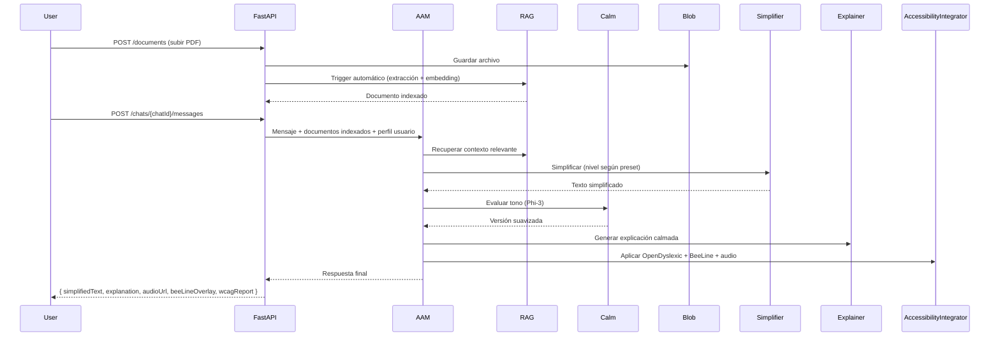

# PRD: DocSimplify AI

> **One API call. Any document. Any neurodiverse user. Cognitive load reduced instantly.**

---

## 1. Problem Statement

En 2026, las personas con **dislexia, TDAH y autismo** siguen enfrentando una barrera enorme: la sobrecarga cognitiva al leer documentos densos (contratos, syllabi, reportes, manuales, emails largos, artículos académicos).

Aunque existen herramientas aisladas (Immersive Reader, BeeLine, OpenDyslexic), ninguna resuelve el problema completo:

- La simplificación manual es lenta y subjetiva.
- Las herramientas genéricas no adaptan el contenido al perfil real del usuario ni aprenden de su fatiga.
- No existe memoria persistente de preferencias ni feedback loop automático.
- No hay explicabilidad calmada (“cambié esto porque…”).
- No hay pipeline RAG que combine documentos subidos por el usuario con su perfil de accesibilidad.
- Docentes y empresas pierden semanas configurando soluciones fragmentadas.

**Resultado**: millones de personas neurodiversas leen con ansiedad, pierden retención y reducen su productividad entre 40-60%.

**DocSimplify AI elimina ese gap por completo.**

---

## 2. Vision

**DocSimplify AI — El ecosistema cognitivo que transforma cualquier documento en una experiencia accesible, personalizada y calmada en una sola llamada.**

No es solo un simplificador de texto. Es un **ecosystem configurator** completo para neurodiversidad:

- **Perfil dinámico persistente** (memoria de preferencias + historial de fatiga)
- **Agente de Adaptación Multimodal (AAM)** — orquesta simplificación, explicación calmada y verificación
- **Pipeline RAG automático** (subida → extracción → embedding → grounding)
- **Evaluador de Calma** (Phi-3) — garantiza lenguaje anti-ansiedad
- **Explicabilidad total** — siempre explica por qué cambió cada parte
- **Presets de accesibilidad** (Dislexia, TDAH, Combinado, Docente)
- **Integración nativa** con OpenDyslexic, BeeLine Reader, ReadSpeaker e Immersive Reader

**Antes**: “Subí un PDF de 40 páginas y sigo sin entenderlo.”

**Después**:  
`POST /api/v1/chats/{chatId}/messages`  
→ El agente devuelve texto nivel A2 + bullets + audio calmado + explicación + overlay BeeLine + reporte WCAG.

El mismo ecosistema funciona para un estudiante, un profesional o un docente, sin importar el dispositivo.

---

## 3. Target Users

**Primary**  

- Estudiantes escolar, secundaria y universitarios con dislexia/TDAH  
- Profesionales neurodiversos (desarrolladores, abogados, administrativos, managers)  
- Docentes y terapeutas que preparan material inclusivo  

**Secondary**  

- Empresas con programas de diversidad e inclusión  
- Universidades y centros educativos  
- Terapeutas y coaches especializados en neurodiversidad  

---

## 4. Casos de Uso

**Caso 1 – Estudiante universitario con dislexia**  
Sube el syllabus de 35 páginas → recibe versión nivel A2 con OpenDyslexic + BeeLine gradient + audio ReadSpeaker + explicación calmada. Tiempo de lectura reducido de 2 h a 25 min.

**Caso 2 – Profesional con TDAH**  
Sube contrato laboral de 18 páginas → recibe resumen en bullets con deadlines destacados + versión Immersive Reader + explicación de cambios. Reduce ansiedad y errores de comprensión.

**Caso 3 – Docente preparando material**  
Sube un mismo artículo académico → genera 3 versiones simultáneas (A1 para dislexia severa, A2 para TDAH, B1 para referencia) + reporte WCAG automático.

**Caso 4 – Usuario recurrente**  
En la segunda sesión, el agente recuerda que el usuario prefiere frases <10 palabras y timers de 18 min → adapta automáticamente el siguiente documento.

**Caso 5 – Equipo corporativo**  
Administrador configura preset “TDAH” para todo el equipo → todos los documentos subidos heredan el mismo nivel de simplificación y tono calmado.

---

## 5. Componentes del Ecosistema

| Componente                                | Propósito                                                      | Prioridad |
| ----------------------------------------- | -------------------------------------------------------------- | --------- |
| **Agente de Adaptación Multimodal (AAM)** | Orquestador principal + memoria de perfil                      | P0        |
| **Perfil Dinámico**                       | Preferencias + historial de fatiga (Cosmos DB)                 | P0        |
| **Pipeline RAG**                          | Subida → Blob → Form Recognizer → Embeddings → Azure AI Search | P0        |
| **Simplifier Agent**                      | Plain Language A1-C1 + bullets                                 | P0        |
| **Explainer Agent**                       | Explicaciones calmadas (“cambié esto porque…”)                 | P0        |
| **Calm Evaluator Agent**                  | Phi-3 como linter de empatía                                   | P0        |
| **Validator Agent**                       | WCAG 2.2 + Accessibility Insights + Content Safety             | P0        |
| **Accessibility Integrator**              | OpenDyslexic + BeeLine + ReadSpeaker fallback                  | P1        |

**Presets de accesibilidad**

| Preset        | Lectura                      | Tono            | Herramientas externas         | Uso recomendado |
| ------------- | ---------------------------- | --------------- | ----------------------------- | --------------- |
| **Dislexia**  | A1-A2                        | Muy calmado     | OpenDyslexic + BeeLine fuerte | Estudiantes     |
| **TDAH**      | A2-B1                        | Corto + bullets | BeeLine + timers              | Profesionales   |
| **Combinado** | A2                           | Ultra calmado   | Todo activado                 | Uso general     |
| **Docente**   | Múltiple niveles simultáneos | Neutro          | Reportes WCAG                 | Educadores      |

---

## 6. User Experience

### 6.1 Arquitectura Técnica (Backend)

- **Framework principal:** FastAPI
- **Orquestación de agentes:** Microsoft Foundry Agent Service v2
- **Almacenamiento:** Blob Storage + Cosmos DB
- **RAG:** Azure AI Search (embeddings automáticos)
- **Modelos:** GPT-4o + Phi-3 (Model Catalog)
- **Autenticación:** Entra ID

Routers principales (tal como acordamos):

- `/auth` (register / login)
- `/users` (CRUD + preferencias)
- `/documents` (upload / list / delete)
- `/chats` (conversación con el agente AAM)

Flujo RAG automático:

- Usuario sube documento → `/documents`
- Se guarda en Blob Storage
- Trigger automático: Form Recognizer → embeddings → indexado en Azure AI Search
- El documento queda disponible para cualquier chat

### 6.2 Flujo Principal (Chat Conversacional)



### 6.3 Non-Interactive / API Mode

Soporta llamadas directas para integraciones (Notion, Teams, LMS):

```bash
curl -X POST https://api.docsimplify.ai/v1/chats/abc123/messages \
  -H "Authorization: Bearer $TOKEN" \
  -d '{"message": "Simplifica este contrato", "documentIds": ["doc-uuid"]}'
```

### 6.4 Presets y Personalización

El usuario elige preset al crear perfil o en el primer chat:

- **Dislexia** → OpenDyslexic fuerte + frases muy cortas
- **TDAH** → Bullets + timers Pomodoro adaptados
- **Combinado** → Todo activado + Evaluador de Calma máximo
- **Docente** → Genera múltiples niveles simultáneos

### 6.5 Next Steps después del primer uso

- “Prueba diciendo: ‘Simplifica el capítulo 3’”
- “Activa BeeLine overlay en la vista previa”
- “Configura tu nivel de lectura predeterminado”

---

## 7. Package Structure (Proposed)

```markdown
docsimplify/
├── src/
│   ├── main.py                          # FastAPI entrypoint
│   ├── core/
│   │   ├── config.py                    # settings, Azure credentials
│   │   ├── security.py                  # Entra ID + JWT
│   │   └── middleware.py                # rate limit, logging
│   ├── api/
│   │   └── v1/
│   │       ├── routers/
│   │       │   ├── auth.py
│   │       │   ├── users.py
│   │       │   ├── documents.py
│   │       │   └── chats.py             # endpoint principal
│   ├── agents/
│   │   ├── adaptation_agent.py          # AAM – orquestador principal
│   │   ├── parser_agent.py
│   │   ├── simplifier_agent.py
│   │   ├── explainer_agent.py
│   │   ├── calm_evaluator.py            # Phi-3 linter
│   │   └── validator_agent.py
│   ├── services/
│   │   ├── blob_service.py
│   │   ├── search_service.py            # Azure AI Search RAG
│   │   ├── profile_service.py
│   │   └── accessibility_service.py     # OpenDyslexic + BeeLine
│   ├── models/
│   │   └── schemas.py                   # Pydantic models
│   └── utils/
│       ├── calm_prompts.py
│       └── plain_language_rules.py
├── tests/
│   ├── unit/
│   └── integration/
├── infrastructure/
│   └── bicep/                           # IaC completo
├── .env.example
├── requirements.txt
└── README.md
```

---

## 8. Non-Functional Requirements

**Rendimiento**  

- Latencia chat < 1.8 s  
- Indexación RAG < 8 s (hasta 50 páginas)

**IA Responsable**  

- 100% lenguaje calmado (Evaluador de Calma)  
- Explicabilidad obligatoria  
- Perfiles nunca viajan completos en prompts

**Seguridad**  

- Encriptación AES-256 en perfiles  
- Entra Agent Identity por agente  
- Bloqueo automático de datos sensibles

**Escalabilidad**  

- Serverless (Azure Functions + Foundry)  
- Multi-tenant por usuario

---

## 9. Success Metrics

| Métrica                                | Objetivo |
| -------------------------------------- | -------- |
| Reducción percibida de carga cognitiva | > 45%    |
| Precisión de simplificación            | > 92%    |
| Uso correcto de preset                 | > 85%    |
| Satisfacción (NPS)                     | > 70     |
| Latencia promedio                      | < 1.8 s  |
